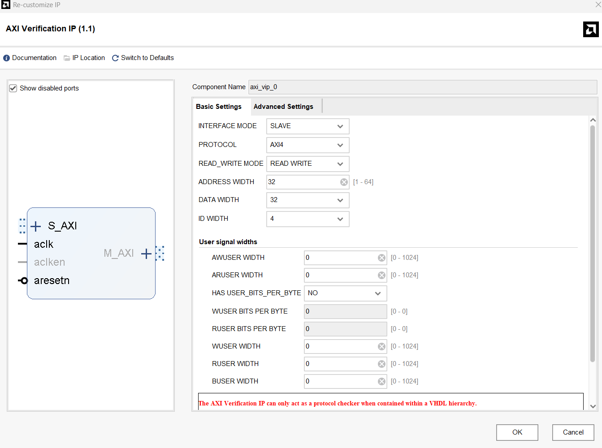
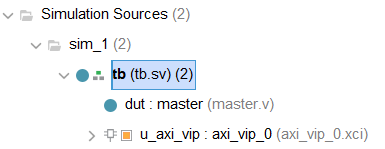
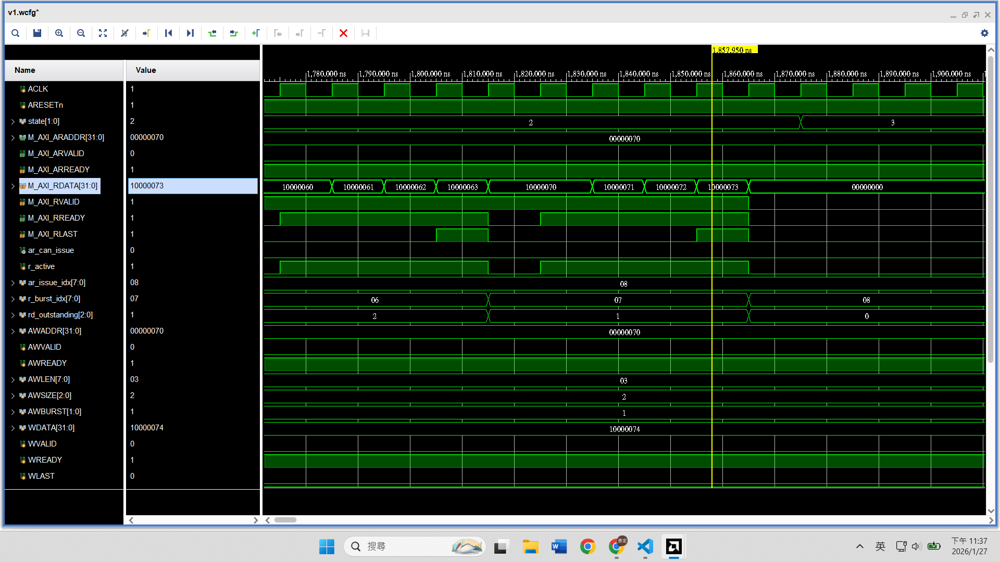

# AXI VIP
本章節將介紹如何使用 Xilinx 內建的 **AXI Verification IP (VIP)** 驗證自定義的 AXI Master IP

## AXI VIP 簡介 
AXI VIP 是 Xilinx (AMD) 提供的驗證用 IP Core，支援 AXI3、AXI4 及 AXI4-Lite 協定。它能夠扮演 Master、Slave 或 Pass-through (Monitor) 三種角色，具備產生 Transactions、檢查協定 (Protocol Checking) 以及模擬記憶體模型 (Memory Model) 的功能。

在本章節中，我們將 AXI VIP 配置為 AXI4 Slave Mode，用來模擬記憶體並驗證我們寫的 Master IP。

## AXI Master IP 版本說明
本章節將 AXI IP 的開發過程拆解為六個階段 (`src/v1` ~ `src/v6`)，主要邏輯皆為 Write-then-Read 測試：
- v1：AXI4-Lite 轉 AXI4-Full 的基礎實作
- v2：實作 Write Burst 功能
- v3：實作 Read Burst 功能
- v4：支援 Write Outstanding (AW / W 通道時序相依)
- v5：優化 Write Outstanding (AW / W 通道時序獨立)
- v6：支援 Read Outstanding，完成 Full Outstanding

## Testbench 架構說明
本章節的 Testbench (`src/tb.sv`) 採用直接對接，將我們設計的 AXI Master IP (DUT) 與 AXI VIP 相連。VIP 的控制則是透過 SystemVerilog 進行

以下解析 tb.sv 的各個段落
1. 匯入必要 VIP 套件
```verilog
import axi_vip_pkg::*;      // 包含 AXI 協定的通用定義
import axi_vip_0_pkg::*;    // 包含此特定 VIP 實例 (Instance) 的參數定義
```
2. 共用的 clock, reset 訊號
```verilog
// clock & reset
logic ACLK;
logic ARESETn;

initial begin
ACLK = 0;
forever #5 ACLK = ~ACLK;   // 100 MHz
end

initial begin
ARESETn = 0;
repeat (20) @(posedge ACLK);
ARESETn = 1;
end
```

3. 訊號宣告與模組連接
```verilog
// AXI signals
...
// DUT: Custom AXI Master
master dut (
    ...
);
// AXI VIP (Slave)
axi_vip_0 u_axi_vip (
    ...
);
```

4. 宣告 Slave Agent 物件 (型別定義來自 axi_vip_0_pkg)
```verilog
axi_vip_0_slv_mem_t slv_agent;
```
5. 啟用 AXI VIP
```verilog
initial begin 
    // 等待 Reset 釋放
    wait (ARESETn === 1'b1);
    repeat (20) @(posedge ACLK);

    // 建構 Agent 並綁定硬體
    // 綁定軟體物件 (slv_agent) 與硬體實例 (u_axi_vip.inst.IF)
    slv_agent = new("slv_agent", u_axi_vip.inst.IF);

    // 啟動 Slave 模式
    // 呼叫此函數後，VIP 會開始監聽 AXI Bus，並自動對合法的讀寫請求做出回應
    slv_agent.start_slave();

    $display("[TB] AXI VIP slave started");
end
```
- 透過這幾行 SystemVerilog code，就能獲得了一個功能完整、符合 AXI 協定且帶有錯誤檢查功能的 Memory Model，大幅省去手寫 Testbench 的時間


## Demo
1. Create a new vivado project
2. 從 IP Catalog 加入 AXI VIP
3. 設定 AXI VIP
    
4. Add design source，`src/master_v*.v`
5. Add simulation source，`src/tb.sv`
    
6. Run simulation
7. Check the waveform (or console)  
    以 v6 為例  
    


