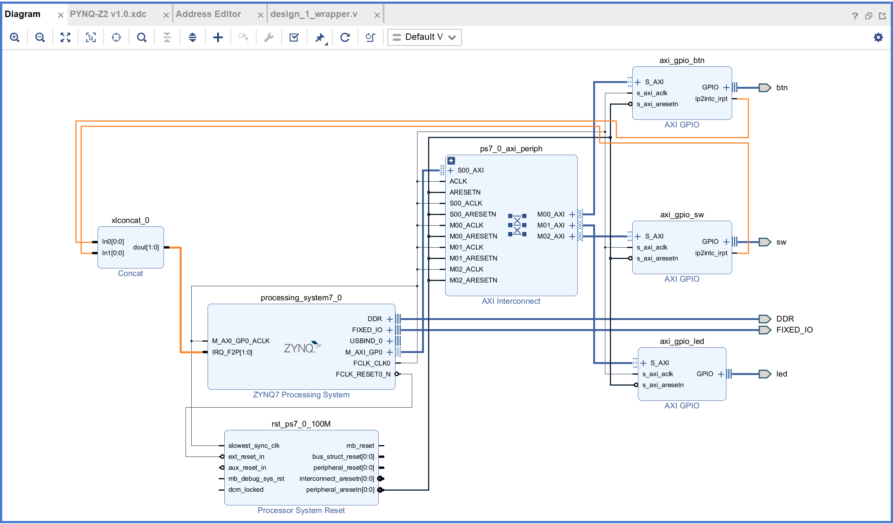
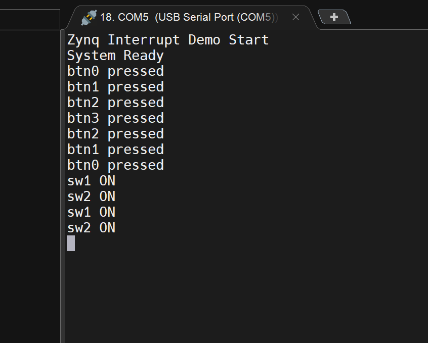

# Zynq Interrupt System

## Introduction

在嵌入式系統中， `Interrupt` 是處理非同步事件的核心機制。相比於 `Polling`， Interrupt 能讓 CPU 在事件發生時才進行處理，大幅提升系統效率與即時性

本實作基於 **Zynq SoC** 的 **GIC(Generic Interrupt Controller)**，整合來自 PL 端的多個 GPIO Interrupt

- **GIC (Generic Interrupt Controller)**：Zynq PS 端負責管理所有中斷的核心單元，負責彙整來自 PL來自 PL (Programmable Logic) 或 PS (Processing System) 的訊號，並根據優先級將其導向 CPU

- **ISR (Interrupt Service Routine)**：當中斷發生時，CPU 會暫停目前任務，讀取 GIC 的 **IAR (Interrupt Acknowledge Register)** 確認中斷 ID，並執行對應的 ISR function

## Vivado Hardware Design

**2.1 Block Design 架構**

在 Vivado IP Integrator 中，需建立以下連接：

1. **ZYNQ7 Processing System**

- 啟用 `IRQ_F2P` 介面（PL -> PS）

2. **AXI GPIO_0 (Buttons)**

- 啟用 `Enable Interrupt`

- 將 `ip2intc_irpt` 連接至 **Concat In0**

3. **AXI GPIO_1 (Switches)**

- 啟用 `Enable Interrupt`

- 將 `ip2intc_irpt` 連接至 **Concat In1**

4. **AXI GPIO_2 (LEDs)**

- 連接 4 顆 LED 作為輸出顯示

5. **AXI Interrupt Concat**

- 設定 `Number of Ports` 為 2

- 將兩個 GPIO 的單一中斷線合併，傳送給 Zynq PS 的 **IRQ_F2P**

**2.2 Interrupt Mapping**

Zynq GIC 的 **Shared Peripheral Interrupts (SPI)** 起始值為 32，而 PL 端中斷在 GIC 中具有固定偏移量 29

計算公式：`ID = 32 (Base) + 29 (PL Offset) + Concat Port Index`

| Source Device | Concat Port | Calculation        | ID |
|---------------|-------------|--------------------|----|
| Buttons       | In0         | 32 + 29 + 0        | 61 |
| Switches      | In1         | 32 + 29 + 1        | 62 |

## Vitis Software Design

**3.1 程式邏輯**

1. **Initialization**

- 初始化 GIC 與 GPIO 

- 設定觸發類型為 `Rising Edge (0x3)`

2. **Binding**

- 將 **Interrupt ID 61** 綁定至 `Button_ISR`

- 將 **Interrupt ID 62** 綁定至 `Switch_ISR`

3. **Interrupt Service Routine**

- ISR 被觸發後，讀取 GPIO 數值

- 更新對應的 LED 或執行其他任務

- Clear Interrupt Flag， 允許下一次觸發

**3.2 ISR 實作**

1. `Button_ISR()`

- 按下 button 對應的 LED 會亮 

- 並 print `btnx pressed`

2. `Switch_ISR()` 

- 打開 switch 會 print `swx on`

**3.3 為什麼只需要一條中斷線**

- CPU 只看到一條 IRQ/FIQ 線被觸發

- GIC 內部會記錄所有 Interrupt ID

- 根據 ID 呼叫對應的 ISR

因此，一條中斷線即可區分多個外設中斷來源