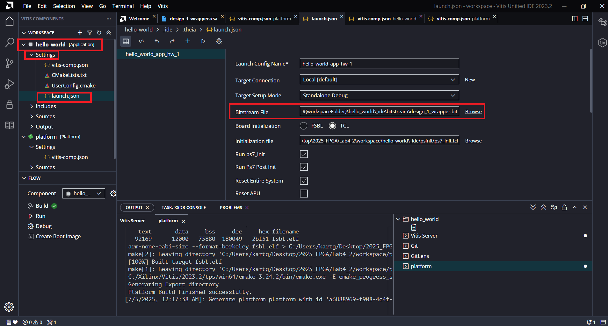

# Extra1-Vitis-Change-xsa-and-Update-Bitstream

由於 Vitis 在更新 Vivado 硬體設計時，不會自動將新的 bitstream 檔更新到 Application Project 中，因此每當你在 Vivado 中對硬體設計進行修改並產生新的 `.xsa` 檔案後，必須手動更新 Application Project 所使用的 bitstream，才能確保執行時載入的是修改過後的硬體。

## Solution 1 (Recommended)

1. Generate new bitstream and export `.xsa` file in Vivado

2. 點選 `your_platform_component -> Settings -> vitis-comp.json -> Switch XSA`，選擇剛剛產生出來的新版 `.xsa` 檔案  

    

3. Build Platform

4. 將 Platform Component 產生的 bitstream（通常路徑為）：

    ```shell
    {workspace}/platform/hw/sdt/system_wrapper.bit
    ```

    手動複製到 Application Project 的目錄下，取代原本的 bitstream：

    ```shell
    {workspace}/app/_ide/bitstream/system_wrapper.bit
    ```  

5. Build Application

## Solution 2

1. 步驟與 Solution 1的 `1~3.`相同

2. 點選 `your_application_project -> Settings -> launch.json`中找到並開啟 launch.json

      

    將其改成如下的 Bitstream 路徑

    ```shell
    ${workspace}/platform/hw/sdt/system_wrapper.bit
    ```

3. Build Application

>📌 Note：  
> Switch XSA 僅更新 platform metadata，bitstream 不會自動覆蓋
>
> 若沒有手動複製或指定 .bit 檔，Application 仍會使用舊版本，導致執行結果錯誤
