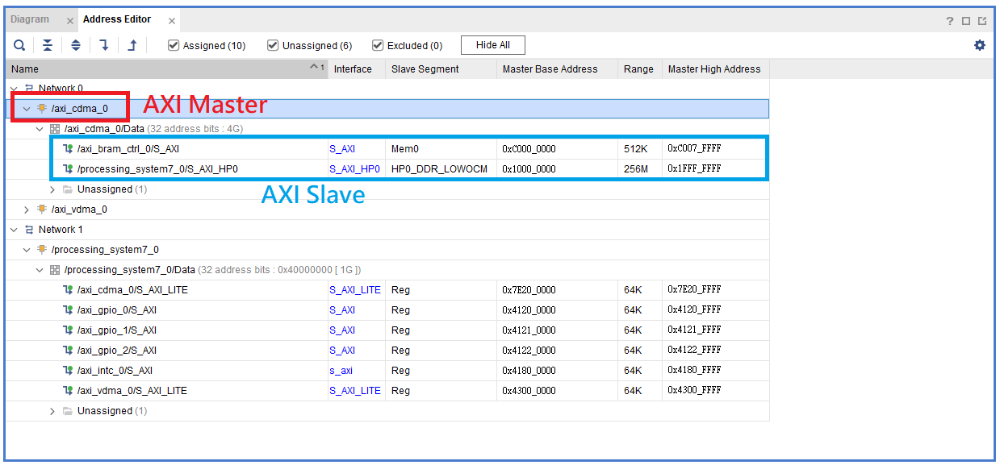
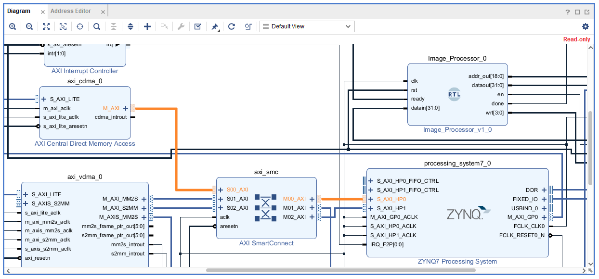
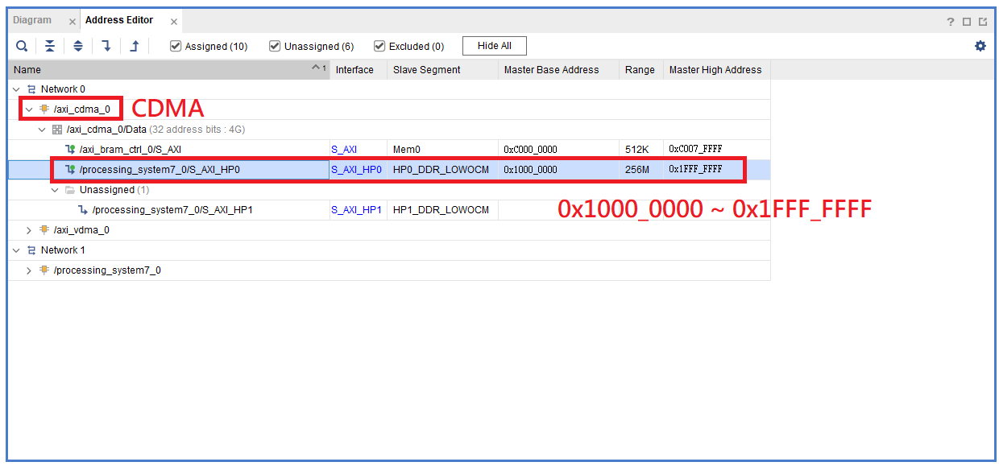

# Extra2-AXI-Mapping

**以下教學皆以 PYNQ-Z2 (ZC7020) 為主**，根據 **PYNQ-Z2** 的 Spec 可以發現板子上有 **512 MB 的 DDR3** 記憶體可以使用。


觀察 ZYNQ7 Processing System 時，可以發現 Master GP0 (General Purpose Port 0) 提供一組 AXI 匯流排給 PL 使用。其中 `M_AXI_GP0_ARADDR` 與 `M_AXI_GP0_AWADDR` 皆為 32-bit 寬度，代表這條 AXI 匯流排可以對應到最多：  

```txt
2^32 = 4GB 的空間（Addressable Space）
```

但實際上我們只有 512 MB 的實體 DDR3 記憶體空間，而這 4GB 的位址空間 (32bit width) 會被劃分並 Map 到不同的設備或 PL AXI IP:

- DDR3 記憶體（PS DDR）
- AXI GPIO、AXI BRAM 等 PL 端 IP
- PS 的內建周邊（如 UART、SPI、I2C、SD 卡）
- On-Chip Memory（OCM）

| 地址範圍 | 用途 |
| ------- | ---- |
| `0x0000_0000 ~ 0x1FFF_FFFF` | PS DDR3（512MB Memory）|
| `0x4000_0000 ~ 0x4FFF_FFFF` | PL AXI IP（AXI GPIO、AXI BRAM 等） |
| `0xF800_0000 ~`             | PS 外設（UART、I2C、SPI 等） |
| `0xFFFC_0000 ~ 0xFFFF_FFFF` | OCM（內建 SRAM，256KB） |

## AXI Master 與 Slave 的角色關係

在 AXI Protocol 中，每一筆傳輸都會發生在 `一個 Master` 和 `一個 Slave` 之間。

### AXI Master

- 主動端
- 負責發出傳輸請求（例如：我要讀這塊記憶體、我要寫進這塊位址）
- 常見的 Master:
  - ARM CPU
  - DMA（如 AXI CDMA、VDMA）

### AXI Slave

- 被動端
- 等待 Master 傳過來的地址與資料，回應讀寫請求
- 常見的 Slave：
  - AXI GPIO
  - AXI BRAM Controller  

當 Master 發出一筆傳輸請求時，它會同時送出一個 `Target Address`，這個地址會由 `AXI Interconnect` 或 `SmartConnect` 判斷它對應的是哪一個 Slave。  

這背後的邏輯就是我們在 Vivado Address Editor 中設定的 Base Address / Range，只要是要寫入或讀取某個 IP 的記憶體區段，就必須確保該 Address 落在該 Slave IP 所屬的 Address Range 之內。這樣 AXI 系統中的 Interconnect IP 才能正確把資料送到對應的 Slave Module。



## AXI Interconnect / AXI Smart Connect


AXI Interconnect 或 AXI SmartConnect 為一個 AXI 匯流排的「轉接站」，來負責「幫 Master 尋找對應的 Slave」

- 將一個或多個 AXI Master 連接到 一個或多個 AXI Slave

- 根據 Master 發出的 Address 將傳輸請求轉送給正確的 Slave

- 負責管理 AXI 傳輸 handshake、Arbitration、資料寬度轉換、時脈轉換等底層邏輯

## 0x0000_0000 ~ 0x1FFF_FFFF 系統主記憶體

`0x0000_0000 ~ 0x1FFF_FFFF` 這段 Address Range 對應的是 **ZYNQ PS 所使用的 DDR3 主記憶體**。在 Linux（PYNQ）或裸機開發中，這段記憶體是 ARM Cortex-A9 CPU 執行作業系統與應用程式的主要空間，**屬於 PS 專屬的記憶體區段**。

> ⚠️  一般 PL 端的 AXI IP（如 AXI GPIO、AXI BRAM 等） 是無法且禁止直接 Mapping 到這段區域的。  

- PL 端的 AXI IP 並不能直接訪問 PS 內部的 DDR 控制器
- DDR 是掛在 ZYNQ 的 PS 側  
- 只有 PS 本身，或透過 ZYNQ7 PS 所提供的 AXI HP（High Performance）Port，才能合法存取該區段

### 若要讓 PL 存取 DDR3 主記憶體，必須透過 HP Port

當我們在設計中使用像是 AXI DMA 或 AXI CDMA 這類支援直接記憶體存取（Direct Memory Access, DMA）的 IP 時：

- 這些 IP 作為 AXI Master

- 其主要資料傳輸 Port（如 M_AXI_MM2S / M_AXI_S2MM / M_AXI）  
    必須連接到 ZYNQ PS 的 HP Port（如 S_AXI_HP0）

- 並在 Vivado Address Editor 中設定映射至 DDR 範圍
  - Base Address: 0x10000000
  - High Address: 0x1FFFFFFF  

這樣該 DMA IP 才能合法地將資料傳送至 PS DDR，也就是 0x0000_0000 ~ 0x1FFF_FFFF 的範圍內。



