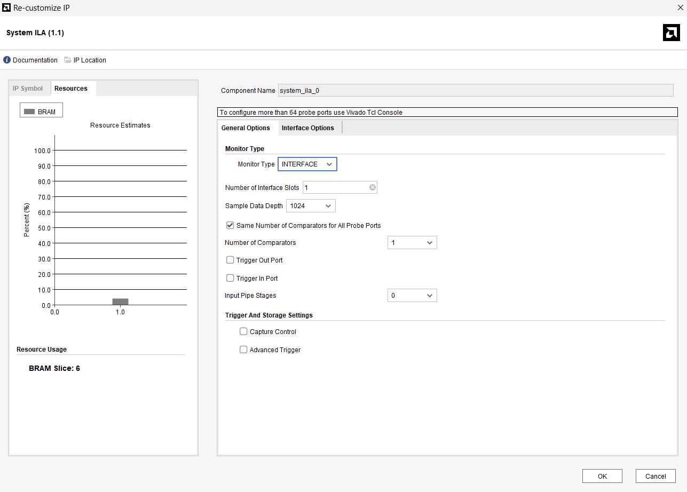
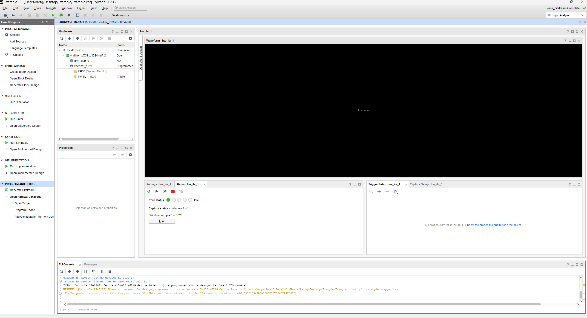
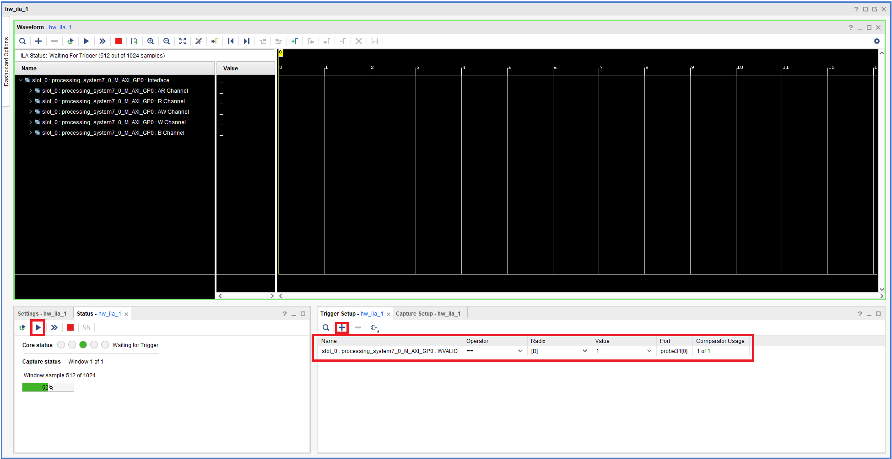

# Extra4-ILA-with-PYNQ

先前在 [Vivado-Tutorial/Extra4-Debugger](../../Vivado-Tutorial/Extra4-Debugger/) 當中已經有教過 Debugger 如何使用，若還沒看過可先回去複習，在本章節中，我們將說明如何在 PYNQ 端執行程式時，即時觀測 PL（Programmable Logic）端的訊號，便於除錯與驗證硬體設計。

## Add System ILA IP

1. 我們這邊沿用 [Part6-PYNQ-Jupyter-Notebook](../Part6-PYNQ-Jupyter-Notebook/) 最後面設計出的 Block Design 作為該次我們要加入 **ILA** 來觀察訊號的電路

    

2. 選取要觀察的電路訊號，點右鍵選取 `Debug` 這邊我以 ZYNQ7_PS 的 Master GP port 為範例，可自行選擇想觀察的訊號

    

    點右鍵選取 `Debug` 後就會看到你要觀察的訊號線有 `綠色的 Bug` 符號在上面

    

3. 點選上方 `Run Connection Automation` 之後你就會看到你的 Block Design 裡面多了 `ILA System` 這顆 IP

    

4. 點開 `ILA System` 的設定可以去調整一些設定

    

    - Monitor Type:  
        `INTERFACE` 表示你要觀察 AXI、AXI-Stream 等「Interface Protocol」的訊號。如果你想自己選擇 signal（如 clock、data、valid），可改選 `NATIVE`，兩者都要則是 `MIX`。

    - Number of Interface Slots:
        表示你要監控幾組 interface，單純 signal 訊號則是 Probe

    - Sample Data Depth:
        表示 ILA 最多可以儲存多少筆樣本資料。越大佔用 BRAM 越多。

    其餘設定自己可以摸索看看

5. Create HDL Wrapper & Generate Bitstream

6. File -> Export -> Export Bitstream

## Using ILA for Signal Monitoring

1. 連線到 Jupyter Notebook，並執行第一個 cell，先載入 `Overlay`

    

2. 點選 Open Target -> Auto Connect 連線到你的板子

    

3. 若檔案配置正確，應該就會跳出 ILA 的 Waveform 視窗，若沒有跳出來則 Program Device 看看

    

    若還是沒有出現通常是因為 **bit 檔**跟 **ltx檔** (ILA的Probe資訊) 指向錯誤的關係，可以從下圖的該處去修改再次 Program Device

    

4. 按照 [Vivado-Tutorial/Extra4-Debugger](../../Vivado-Tutorial/Extra4-Debugger/) 所學的，設定抓取訊號的條件，並按下箭頭開始等待抓取訊號

    

5. 此時可以回到 Jupyter Notebook 執行剩餘的 cell 去對 GPIO 寫入資料，就可以抓到寫入資料時的訊號了

    

    