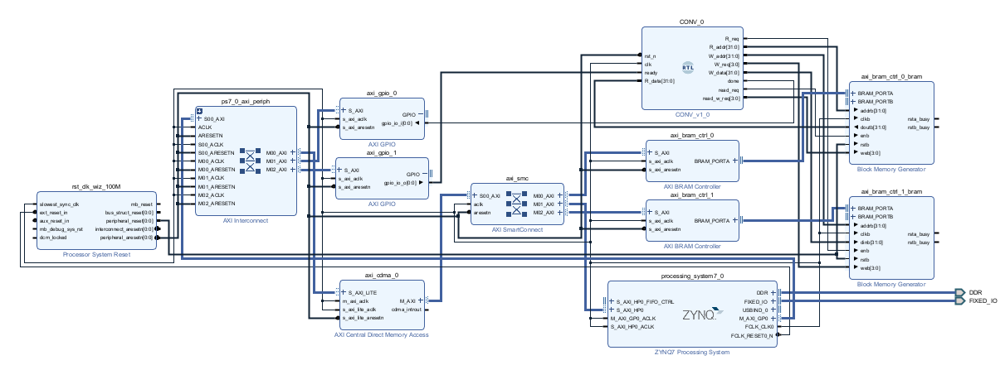
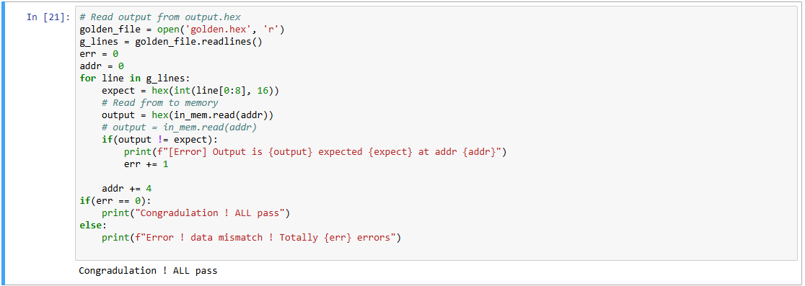

# FPGA Design Lab

在這次的 Lab 中需自行設計一個可執行 convolution 運算的 IP，並以此 IP 建構整個系統。依據提供的 input.hex 以及 golden.hex來進行輸出結果比對。

軟體端僅負責資料搬運，所有 convolution 運算必須在自行設計的 convolution IP 中完成，軟體端不得進行主要運算。

>💡 **Hint：** 使用 Lab3 所學 CDMA 來搬運資料進入 Bram ，Convolution IP 從 Bram 內讀取 input data 後，將卷積結果存回 Bram 內，最後使用 CDMA 來搬運資料回到 PS 端。

## IP 設計注意事項 : 

### Convolution 範例 : 

input及最後convolution的值都是32bit。

Convolution的步驟 :

   1. 做convolution時，將相乘後的結果(64bit)，取[47:16]的值。

   2. 將9個相乘並進位的結果，累加輸出為output。

> **備註：** 
此次 Lab 的 運算中無須加入 bias 。 

> 📌 原始輸入影像大小為 28×28，經過 3×3 kernel 的 convolution 運算（不進行 zero padding）後，輸出影像大小會變 26*26 。

> 📌 有提供 tb 去驗證自行設計的 IP 。

---

### Kernel Value

|   |  |  |
|-------------------|-------------------|-------------------|
| kernel[0] | kernel[1] | kernel[2] |
| 0000A89E | 000092D5 | 00006D43 |
| kernel[3] | kernel[4] | kernel[5] |
| 00001004 | FFFF8F71 | FFFF6E54 |
| kernel[6] | kernel[7] | kernel[8]|
| FFFFA6D7 | FFFFC834 | FFFFAC19 |

---

### Bram 讀寫操作 :

1. 讀取操作（Read Request）：

    對於讀取請求，必須將記憶體模組的 R_req 腳位拉為 1'b1（表示發出讀取請求），並在 addr bus 上給出欲讀取的位址。
    資料將會在一個時脈週期後出現在 R_data 上。

2. 寫入操作（Write Request）：

    對於寫入請求，只需將 R_req 設為 1'b1，W_req 設為 4'b1111（表示所有 byte 都寫入）。
    此時， W_data 的資料會在正緣（positive edge）時被寫入到 addr 指定的位址中。

---
### 參考 Block design  : 

---

### 測試結果 : 
