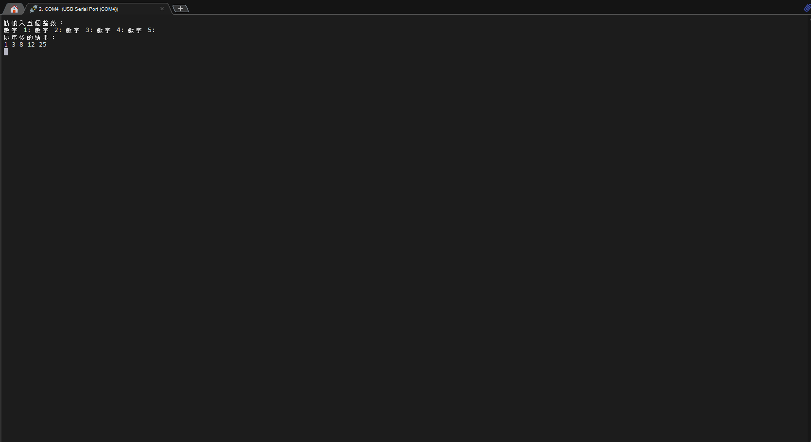
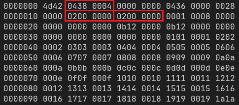
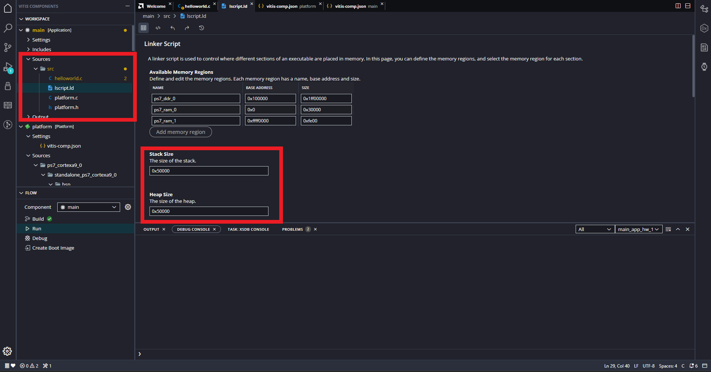

# FPGA Design Lab1

使用 PYNQ-Z2 上的 Zynq Processor 操作簡單的 C/C++  Project。

> [!TIP]
> Block design 可以參考 Part1 的設計

## Problem 1

使用鍵盤輸入五個非負整數後，透過 PS 端 (軟體) 去將這五個數由小到大排序

參考輸出結果：



## Problem 2

在這個 Lab 中，學習如何使用 UART 在 PC 和 PYNQ 之間進行通訊

PC 會透過 UART 傳送一張圖片 (`.bmp`) 到 PYNQ，PYNQ 會將原始圖片經過 **二值化處理 (Binarization)** 後，最後再將轉換後的圖片傳回給 PC

> [!NOTE]
> **二值化處理 (Binarization)**
>
> 對於灰階圖像中每個像素值（0～255），設定一個 threshold，如果像素值高於閾值，就設定為白色（1）；否則設定為黑色（0）
>
> ```python
> # Binarization
>
> if pixel > threshold:
>     pixel = 255  # 白色
> else:
>     pixel = 0    # 黑色
> ```


> [!NOTE]
> BMP file
>
> BMP (Bitmap) 是一種無壓縮的圖片格式，為 Microsoft 開發的點陣圖影像格式，BMP 檔案是由數個 header 以及像素資訊組成
>
> 以下列出了一些 header 中讓我們可以判斷檔案大小與圖片長寬的欄位：
>
> | offset (hex) | size | description                                  |
> | ------------ | ---- | -------------------------------------------- |
> | 02           | 4    | The size of the BMP file in bytes            |
> | 12           | 4    | The bitmap width in pixels (signed integer)  |
> | 16           | 4    | The bitmap height in pixels (signed integer) |
>
> 在 Unix 系統中可以使用 `hexdump <file>` 以 16 進位格式查看檔案內容，以下為 lab 中範例圖片的部分輸出結果：
>
> 
>
> 最左邊的 column 是 offset (十六進位)，其餘部分則是 2 bytes 為一組的 hex value，因此可以對照前面的表格 (注意 BMP 是以 little-endian 來儲存)，檔案大小為 `0x0004_0438` $= 263224$，圖片的長與寬則都是 `0x0000_0200` $= 512$
>
> 有了這些資訊我們也可以間接推算出 header 的大小為 $263224 - 512 \times 512 = 1080$，也就是說要對圖片進行二值化處裡要從 offset = 1080 (十進位) 的位置開始

### Step 1

照著 Part1 的步驟完成 block design 並且建立 platform 、 Application

### Step 2

打開 `Application` → `Source` → `lscript.ld`，更改 `Heap Size` 的值 (將圖片存入該隻程式的 Heap 中)



### Step 3

加入 src 檔案中的 `main.c` ， 自行完成剩餘部分


### Step 4

依序點選

- `Platform` → `Build`

- `Application` → `Build` → `Run`

### Setp 5

執行 `src` 下的 `transfer.exe`，這個程式會將 `src/lena_gray.bmp` 透過 Serial port 傳送到 PYNQ 板子上

也可以自己建立虛擬環境來執行 `transfer.py`：

```shell
py -m venv .venv
.\.venv\Scripts\activate
```

然後安裝所需的套件並執行程式

```shell
pip install -r requirements.txt
python transfer.py
```

> [!WARNING]
> 請先確認 PYNQ 板子是使用哪個 Serial port，然後在 `transfer.py` 修改 `serial.Serial(port="COM4", baudrate=115200)` 中 `port` 的值

### Step 6

打開 `lena_gray_binarization.bmp` 查看結果


