# Part1-Zynq-Processor

Zynq 不僅是一顆 FPGA，它還內建了完整的處理系統，包括：

- 雙核心 ARM Cortex-A9 處理器

- DDR 記憶體控制器、各類 I/O 介面（UART、SPI、USB…）

- AXI 匯流排（用來與 PL 做資料交換）

- 可選擇執行 Linux、PetaLinux、Ubuntu 或 Baremetal 程式

這些處理功能（包含 ARM 處理器、DDR 控制器、AXI 匯流排等）在晶片內部是以 Hard IP 的形式存在。

- PS（Processing System）是預先實作在 Zynq 晶片上的電路區塊，不像 PL 是可程式化邏輯。

- 使用者無法改變其結構（例如 CPU 架構、I/O 分配等），但可以透過 Vivado 的介面啟用、設定、連接。

- 開發者可以透過 **Vivado Block Design** 中的 **ZYNQ7 Processing System IP** 對 PS 做配置，例如選擇是否開啟 USB、Ethernet、UART、SD 卡等功能。

## Purpose

透過 Vivado 配置 `ZYNQ7 PS`，並建立 Vitis Project 達成簡易的 `UART` 顯示

## Part 1.1 Running a Basic UART Application on Zynq PS

在本次實作中，我們將示範如何**僅使用 Zynq PS（Processing System）** 的資源 **（不連接 PL 邏輯）**，利用 ARM Cortex-A9 處理器進行簡單的資料處理並透過 UART 傳回結果。

1. Create a New Vivado Project

2. Create Block Design

3. 點選 Block Design 內的 `+`，搜尋 `ZYNQ7 Processing System`，並加入 Block Design 當中  

    
    

4. 點選上方綠色橫幅 `Run Block Automation`， Vivado會自動幫你完成一些連接線的設置

    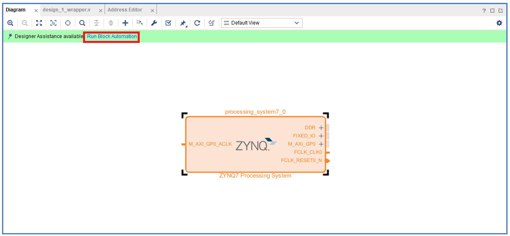

    連接完成後會跳出 `DDR` 、 `FIXED_IO`  

    

    - **DDR** : Zynq PS 與外部 DDR3 記憶體的連接 Port
    - **FIXED_IO**    : Zynq PS 對外部週邊 I/O 的接口

5. 對 ZYNQ7 點兩下進行 `customize`，本次實驗只需用到 ZYNQ processor 本身，所以要把沒用到的 I/O 取消。

    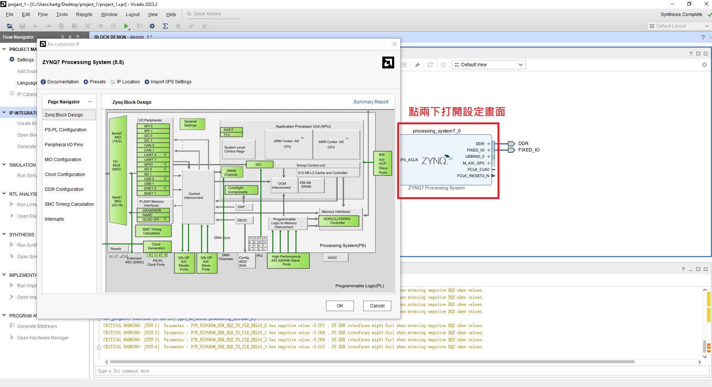

6. 點選跳出的設定頁面中左側的 `Peripheral I/O Pins`，並將所有的 `Peripheral` 都先取消掉，最後勾選 `UART0` 即可

    

    > I/O Bank ?
    >
    > Xilinx FPGA 的 I/O 腳位通常會被劃分為多個 I/O Bank（如 Bank 0、Bank 1...），  
    > 每個 Bank：
    > - 具有獨立的供電電壓（如 3.3V、1.8V）所屬腳位必須使用同樣的電壓等級
    > - 每個 Bank 的腳位支援的 I/O 標準（LVCMOS33、LVCMOS18 等）根據電壓而異  

7. 點選左側 `PS-PL Configuration -> General -> UART0 Baud Rate` 可以設定 UART 的 Baud Rate  

      

8. 點選左側 `Clock Configuration -> PL Fabric Clocks -> FCLK_CLK0取消勾選`

    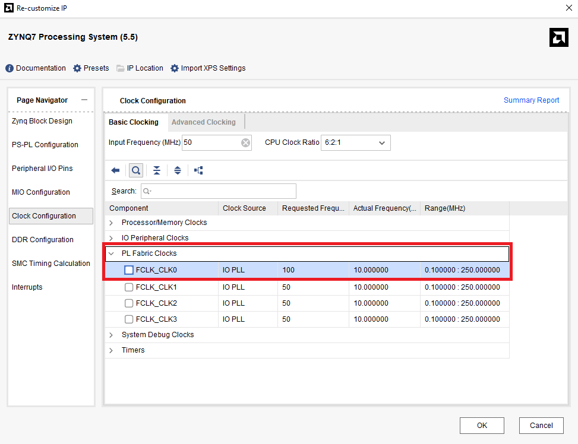  

    > 📌 FCLK (Fabric Clock) 是什麼？
    >
    >FCLK_CLK 是由 Zynq 的 Processing System 內部產生的Clock訊號，通常提供給 Programmable Logic 使用。
    >
    >這次的設計是純 PS、未使用 PL 電路，可以將 FCLK_CLK 關閉，以簡化系統資源與 P&R。
    >
    >若日後有需要由 PS 提供 clock 給 PL，再啟用 FCLK_CLK 即可。  

9. `PS-PL Configurations -> General -> Enable Clock Resets -> FCLK_RESET0_N` 取消勾選
`PS-PL Configurations -> AXI Non Secure Enablement -> GP Master AXI Interface -> M AXI GP0 Interface` 取消勾選  

    

10. 修改完成後，PS最後會長如下圖  

    

11. 將完成的 block design 包成 HDL wrapper  

    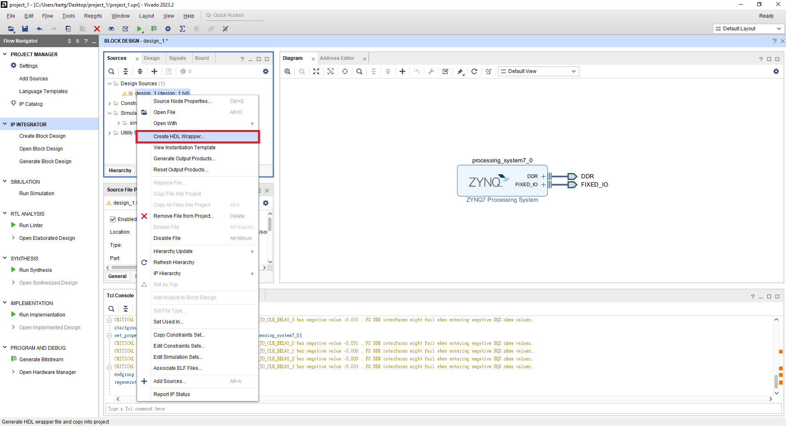

12. Run Implementation，按下 `PROJECT MANAGER > Run Implementation`，即完成本次設計

    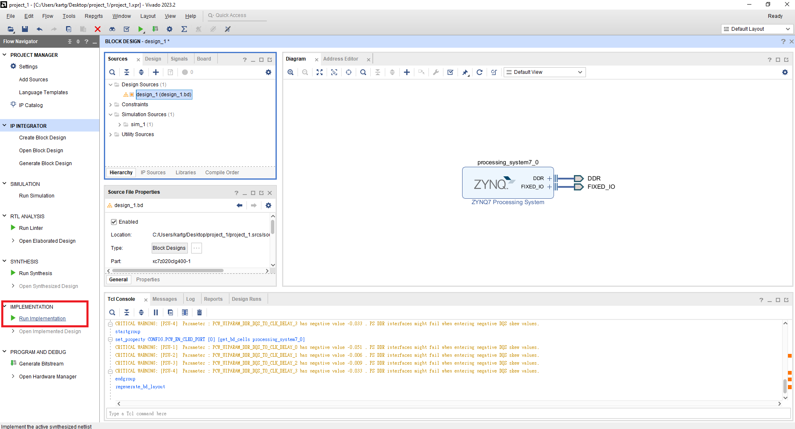

13. Implementation 完後，點選上方 `File > Export > Export Hardware`  

    

14. 選擇 `Pre Synthesis` ，這次設計沒有使用到 Programmable Logic 所以沒有 Bitstream ，後續設計如果有使用到 PL 端就需要 `include Bitstream`

      

    > 📌 為什麼這裡可以不產生 Bitstream?  
    > Bitstream 是用來「配置 FPGA 的 Programmable Logic」。
    > 如果你只用 PS（例如 ARM Cortex-A9 跑一段 UART 程式），完全沒有用到 PL，就不需要產生 .bit 檔，也不需要下載到 PL 裡。  
    > Bitstream介紹在 [Vivado-Tutorial/Part3-FPGA-Design-Flow](../../Vivado-Tutorial/Part3-FPGA-Design-Flow/) 可回去複習

## Part 1.2 Vitis Project

1. 在電腦中搜尋 `Vitis 2023.2` 並打開

    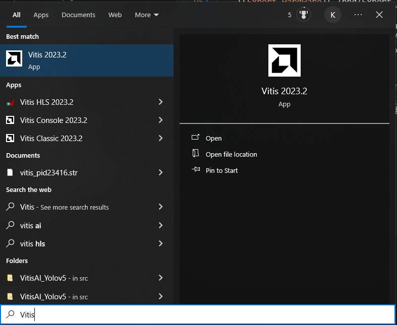

2. 點選 `Open Workspace`， 並在你的 Vivado Project 裡面創建 `workspace` 或是你自己想要的地方也可以  

    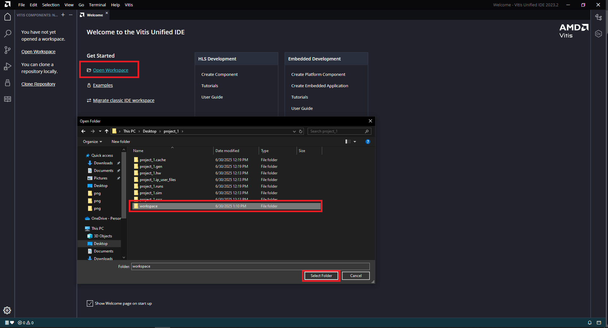

3. 建立新的 `Platform Component (Hardware)`  

    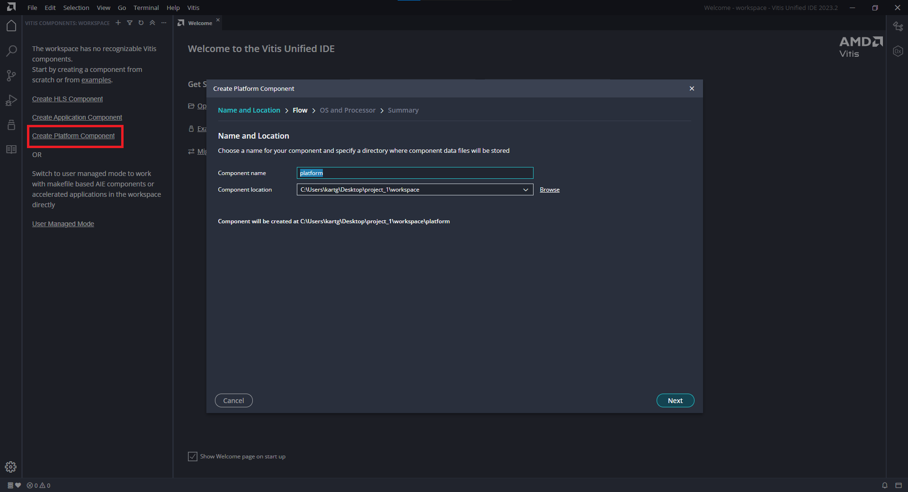

4. 選擇剛剛 export hardware 位置的 `*.xsa`  

    

5. Operating System: `standlone`  
    Processor: `ps7_cortexa9_0`

    

6. 創建好 `Platform Component` 後將如下圖

    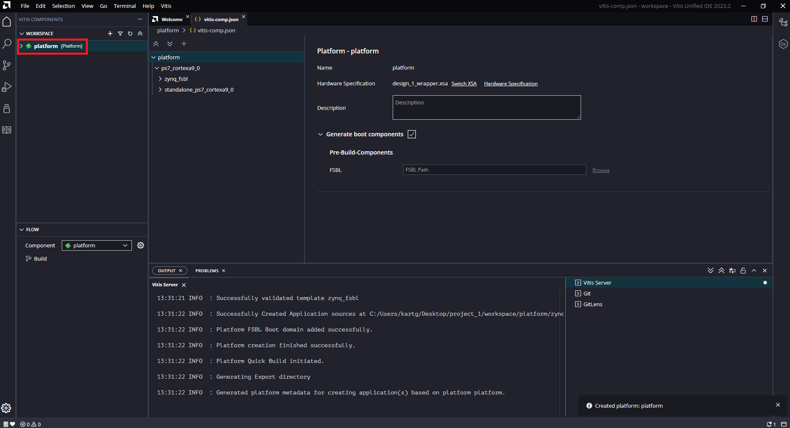

    > 📌 What's Platform Component?  
    > Platform Component 是在 Vitis 中用來描述硬體平台的一個元件，它是根據你從 Vivado 匯出的 .xsa 檔（Hardware Specification + Bitstream）所建立的，並提供給後續 Application Project 使用的硬體基礎環境。
    >
    > 一個 Platform Component 通常包含：
    >
    > - 匯入的 .xsa 硬體描述檔案
    >
    > - 可選的 boot 元件（如 FSBL、PMUFW）
    >
    > - Domain 設定（ARM Core / 作業系統 / 編譯工具鏈）  

7. Create `Application Project (software)`  

    

8. 選擇剛剛完成的 platform  

    

    > Note: 每一個 `Application Project (Software)` 都必須建立在一個 `Platform` 之上  

9. 建立完 `Application Project` 後，將如下圖所示

    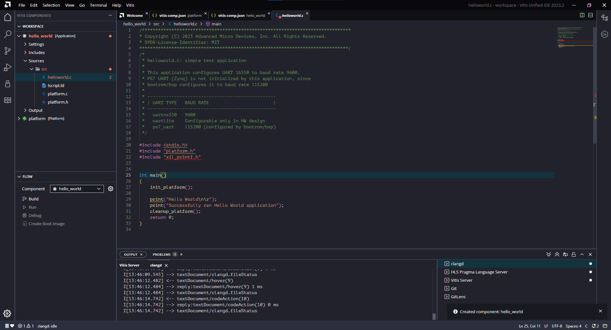

10. 先 `build platform`  

    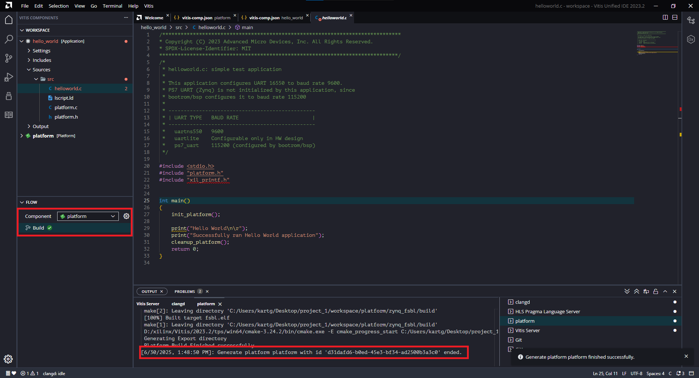  

    `Build Platform` 後，可以將目前開起來的 `helloworld.c` tab 關掉重開，`file not found` 的問題基本上就會解決了

    

    再 `build application`

    

## Part 1.3 Run the Program

1. 將 PYNQ-z2 接上電腦並將開機配置成 `JTAG` (8號區 Jumper)  

      

2. 開啟 `MobaXterm` 並選擇建立 `Serial` 連線，Baud Rate 設置成 `115200`， COM port 則根據你的 FPGA 連接在哪個 COM port 自己決定  

      

    建立連線  

    

3. 回到 `Vitis` 點選 Run  

    

4. 即可在 `MobaXterm` 看到 "Hello World!" 的結果  

    
