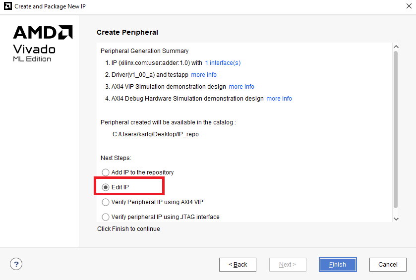
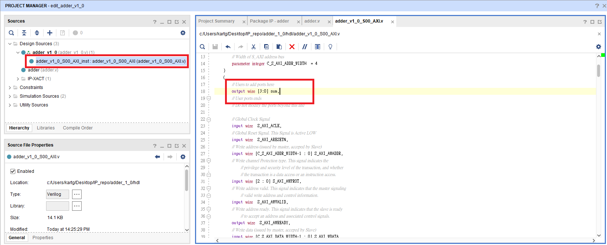
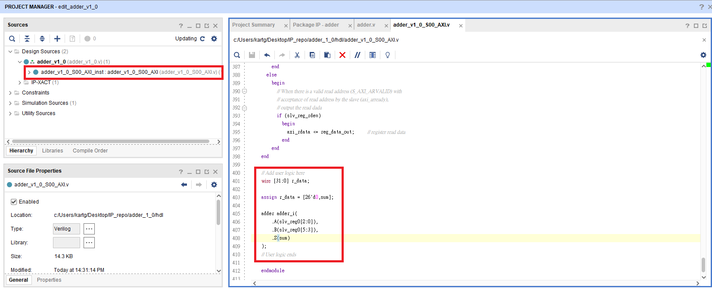
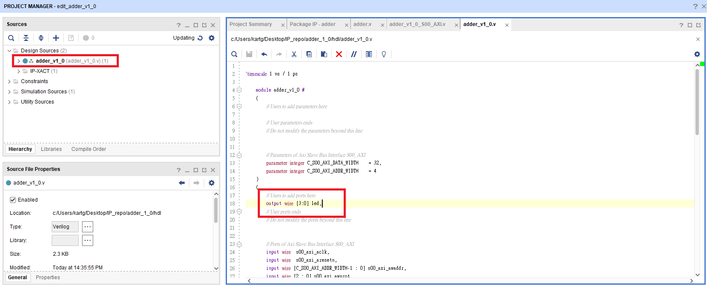
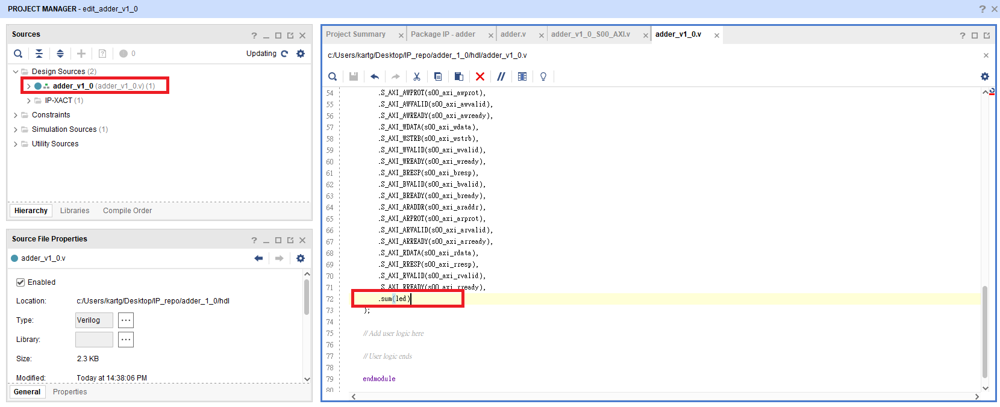
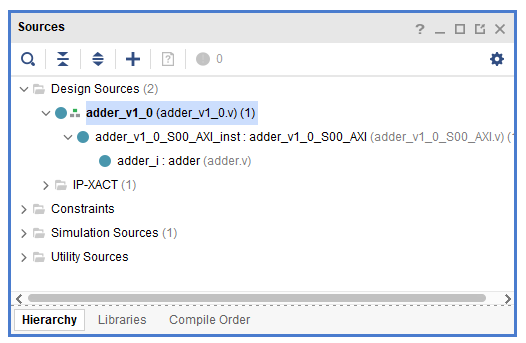
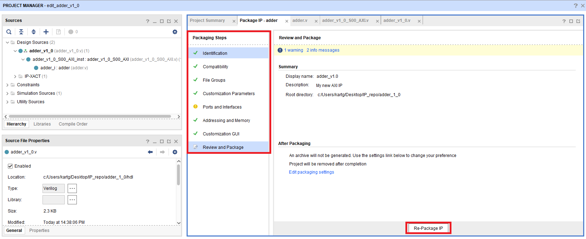
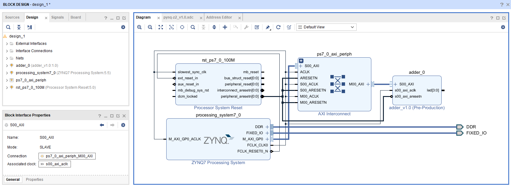
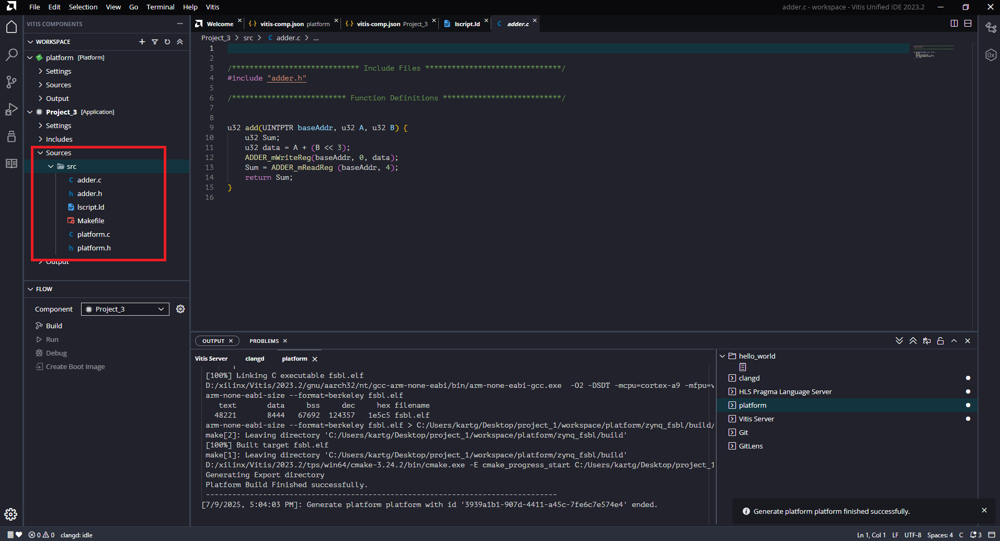

# Part3-AXI-Lite

**AXI-Lite** 是 AXI4 的簡化版本，只有 `單一傳輸通道`、`不支援 burst`，適合小資料量傳輸  

常用於：控制 IP 核心的啟動、初始值設定、讀取狀態與結果


## Part3.1 Create AXI-Lite IP

1. Create a new Vivado project

2. Add `./XDC/pynq-z2_v1.0` into project

3. 點選上方 `Tool -> Create and Package New IP`，接著選擇 `Create a new AXI4 peripheral`。

    

4. 取名為 adder，並且創建一個 IP_repo 的資料夾來裝 IP

    

5. 點選 `Interface Type -> Lite`，並且將 `Number of Registers` 設成 `4`

    

    > 📌 AXI Interface Type 簡介：
    >
    >- AXI4：支援 burst 傳輸，適合大筆資料傳輸（如 DMA）。
    >- AXI4-Lite：簡化版 AXI4，不支援 burst，適合控制類 IP 使用（設定參數、讀寫 Register）。
    >- AXI4-Stream：Stream 介面，沒有 Address wire，適合連續資料處理（如影像、音訊）
    >
    > 📌 Number of Register
    >- 指的是 IP 可對外映射到記憶體位置的 Register（即 slave registers）
    >- 每個 register 預設為 32-bit，可由 ZYNQ PS 透過 AXI4-Lite 以 offset 存取（如：0x00, 0x04, 0x08, ...）

6. 點選 `Edit IP`

    

7. 此時 Vivado 會跳出一個新的 project，並將 `HDL/adder.v` 加入到當中去，該 project 是用來修改 IP 設定的

    

8. 依序照下方圖片修改 Verilog Code

    
    
    
    
    

9. 下圖為最終的 File Hierarchy

    
    - adder_v1_0.v: 最外層的 Top-Level Wrapper 模組
    - adder_v1_0_S00_AXI.v:  AXI4-Lite Interface 控制模組
    - adder.v:  自己設計的邏輯電路模組

    對於 `AXI Handshake Protocol` 有興趣的可以觀看 `adder_v1_0_S00_AXI.v` 內部的實做邏輯  

    AXI-Lite 使用與 AXI4 相同的「握手機制」來控制每一筆資料的傳輸。每個 channel（例如寫入位址、寫入資料、讀取位址等）都採用以下這組訊號配對：

    ```txt
    valid ↔ ready
    ```

    VALID：由 Master 提出，表示「我準備好要送資料了」

    READY：由 Slave 提出，表示「我準備好要接資料了」

    只有當兩邊同時為 1 時，傳輸才會被執行

10. 點開你的 IP repo 資料夾，找到 Adder IP 的 `driver -> your_IP_name -> src` 資料夾，將內部的 `Makefile` 內容替換成 `Driver/Makefile` ， 直接複製貼上內部的內容，不要取代掉該檔案

    

11. 回到 package IP 畫面將沒有打勾的部分點進去修改，最後 Package IP。

    

12. 回到原來的 Project 將剛剛包裝好的 IP 加入進來
    

13. Create Block Design

14. 加入 `ZYNQ7 PS` 和 `adder_v1.0`，並完成下方接線 (基本上自動連接即可)

    

15. 對 `adder_v1.0` 的 Output port led[3:0] 點右鍵 `Make External`

    

16. 將該 Output Port 改名為 `led`

    

17. 檢查 Address Editor 有沒有自動分配 Address 給我們剛寫好的 IP

    

18. Create HDL Wrapper and Generate Bitstream

19. Export `.xsa` (include bitstream)

## Part3.2 Vitis Project

1. 開啟 Vitis 建立 workspace 資料夾，並使用剛剛 Export 出來的 `*.xsa` 建立 Platform Component

2. 透過 Example Project中的 `Hello World` 建立新的 Application Project 加入檔案 `src/main.c` 以及 `Driver/*` 內的程式複製到下圖紅色部分

    

    > 此次教學 Driver 為寫好的版本，若之後包裝其他 AXI IP 需要撰寫 Driver 可至該 IP 的資料夾，內部有該 IP 的 Driver Code 可修改
    >
    > 

3. Vitis 需要的是 `ps7_init.tcl`，然而自製 IP 也有屬於自己的 `tcl`，因此需要到 `Settings\launch.json` 的 `Initialization file` 修正

    

4. Run the Program

    

### Note

若沒有執行 Part 3.1 的第 10 點，則需要修改 platform 中的三個 makefile

- platform/Sources/hw/sdt/drivers/<CustomIP_name>/src/Makefile
- platform/Sources/ps7_cortex_a9_0/standalone_domain/bsp/hw_artifacts/drivers/<CustomIP_name>/src/Makefile
- platform/Sources/zynq_fsbl/zynq_fsbl_bsp/hw_artifacts/<CustomIP_name>/src/Makefile  

將makefile中的 `OUTS = *.o` 修改為 `OUTS=$(addsuffix .o, $(basename $(wildcard *.c)))`
