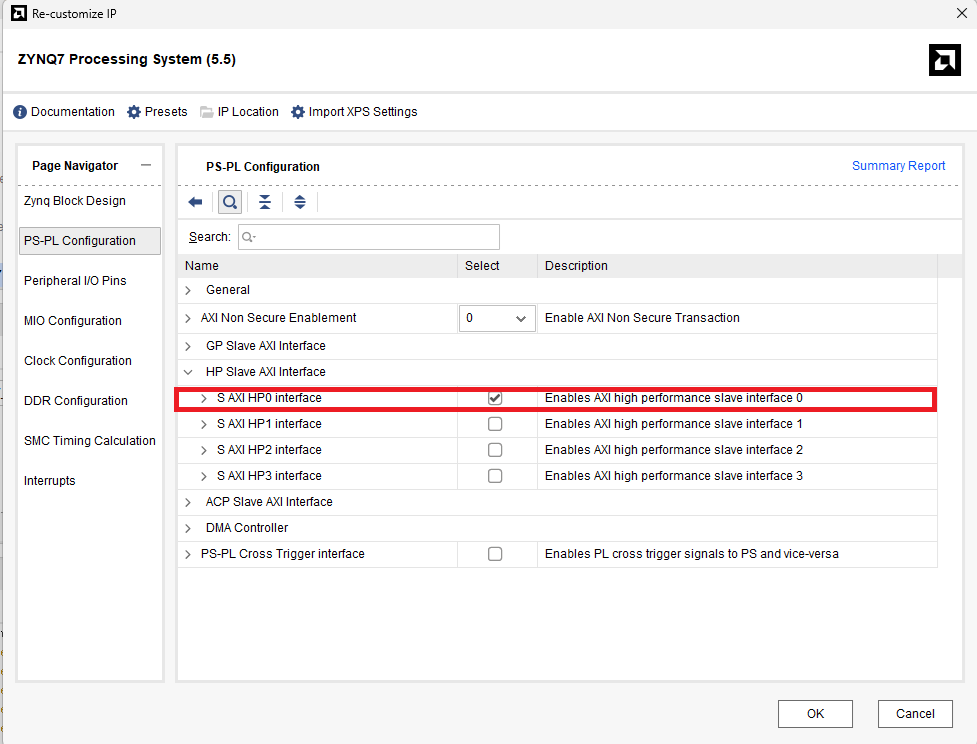
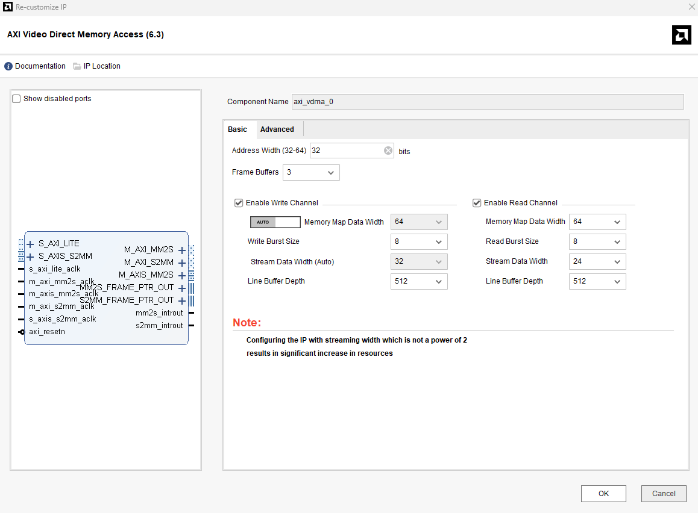
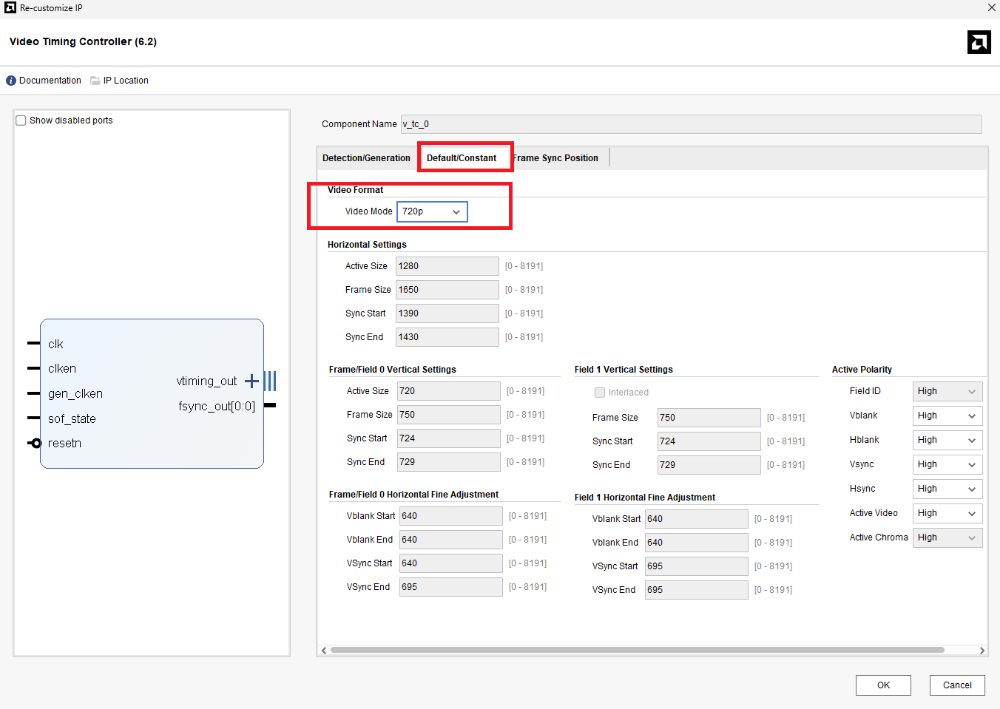
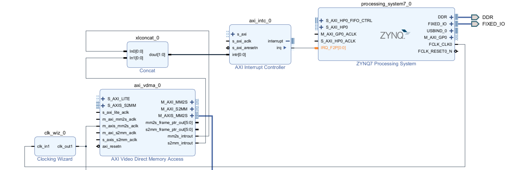
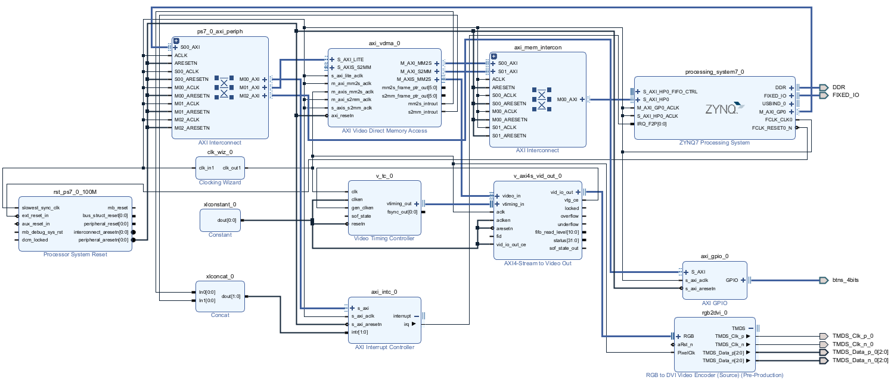

# Part9-HDMI

本章節實作一個基於 FPGA 的 HDMI 影像輸出模組，目的在於將數位影像資料透過 HDMI 介面即時顯示於外部螢幕上。系統可與影像處理模組整合，實現從資料處理到畫面顯示的完整資料流。

## Step 1

至 [https://github.com/Xilinx/PYNQ/tree/master/boards/ip](https://github.com/Xilinx/PYNQ/tree/master/boards/ip)

下載 IP `rgb2dvi_v1_2`及 `If/tmds_v1_0`

## Step 2

開啟 vivado project 後，點擊左側 `setting` > `IP` > `Repository`  > `+`
加入兩個 IP 。

## Step 3

加入 `ZYNQ7 Processing System` 後點擊`Run Block Automation` 。

點選 ZYNQ7 Processing System IP 後，選擇 `PS-PL Configuration` > `HP Slave AXI interface` 將 `HP0` 打勾，在 `PS` 端開啟 slave port 給 `VDMA` 使用。

選擇 `interrupt` > `Fabric Interrupts` > `PL-PS Interrupt Ports` 將 `IPQ_F2P` 打勾。

## Step 4

加入四個 IP

1. `AXI Video Direct Memory Access`
2. `Video Timing Controller`
3. `AXI4-Stream to Video Out`
4. `RGB to DVI Video Encoder`

## Step 5

點擊 `AXI Video Direct Memory Access`

`Stream Data Width` 調到 24

## Step 6

點擊 `Video Timimg Controller`

`Detection/Generation` 取消 `Include AXI4-Lite Interface` 和 `Enable Detection`

`Default/Constant` > `Video Mode` 選 `720P`

## Step 7

點擊 `RGB to DVI Video Encoder` > 取消 `Reset active high` 並選取 `720P`

## Step 8

點選 `RGB to DVI Video Encoder` IP， `output port` `TMDS` 的 `+` 展開所有的 `output port` ，選取全部後點右鍵 `make External` 。

`

## Step 9

手動連線

1. `axi_vdma_0: M_AXIS_MM2S` -> `v_axi4s_vid_out_0: video_in`
2. `v_tc_0: vtiming_out` -> `v_axi4s_vid_out_0: vtiming_in`
3. `v_axi4s_vid_out_0: vid_io_out` -> `rgb2dvi_0: RGB`
4. `v_axi4s_vid_out_0: vtg_ce` -> `v_tc_0: gen_clken`

## Step 10

加入 `Clocking Wizard` ,`AXI Interrupt Controller` 兩個 IP 。

## Step 11

點擊 `Clocking Wizard` > `Output Clocks` > `Requested` 調為 `71.5` ，往下滑後，取消 `reset` ,`locked`

## Step 12

手動接線

1. `PS Block: FCLK_CLK0` -> `clk_wiz_0: clk_in1`
2. `PS Block: FCLK_CLK0` -> `axi_vdma_0: s_axis_s2mm_aclk`
3. `clk_wiz_0: clk_out1` -> `v_tc_0: clk`
4. `clk_wiz_0: clk_out1` -> `axi_vdma_0: m_axis_mm2s_aclk`
5. `clk_wiz_0: clk_out1` -> `rgb2dvi_0: PixelClk`
6. `clk_wiz_0: clk_out1` -> `v_axi4s_vid_out_0: aclk`

## Step 13

加入`Concat`

## Step 14

手動接線

1. `axi_vdma_0: mm2s_introut` -> `xlconcat_0: In0`
2. `axi_vdma_0: s2mm_introut` -> `xlconcat_0: In1`
3. `xlconcat_0: dout` -> `axi_intc_0: intr`
4. `axi_intc_0: interrupt 點開 irq` -> `PS Block: IRQ_F2P`

## Step 15

點擊  `Run Connection Automation` 兩次。

## Step 16

加入 `Constant` 且 `Const Val` 設為 1

## Step 17

手動連線
`xlconstant_0: dout` -> `v_tc_0: clken,resetn`
`xlconstant_0: dout` -> `v_axi4s_vid_out_0: aclken,aresetn,vid_io_out_ce`

## Step 18

加入 `AXI GPIO` 選擇 `btns 4bits`，並按 `Run Connection Automation`，讓 `vivado` 自動接線。

## Step 19

恭喜完成了 `block design` 。

## Step 20

按 `validation` 確認接線無誤，按 `Creat HDL Wrapper` 產生 `verilog code` 。

## Step 21

加入 `constrains gile` : `HDMI.xdc`。

## step 22

`Generate Bitstream` 後 Export `.bit` 檔和 `.tcl` 檔

## step 23

開啟 `Jupyter notebook`

## Reference

<https://github.com/Xinyang-ZHANG/PYNQ-Z2/blob/main>

[Xilinx Video Series and Blog Posts](https://adaptivesupport.amd.com/s/question/0D52E00006hpsS0SAI/xilinx-video-series-and-blog-posts?language=en_US)

[Video Series 23: Generate a video output on Pynq-Z2 HDMI out](https://adaptivesupport.amd.com/s/article/932553?language=zh_CN)

[Video Series 24: Using the AXI VDMA in Triple Buffer Mode](https://adaptivesupport.amd.com/s/article/938327?language=zh_CN)
