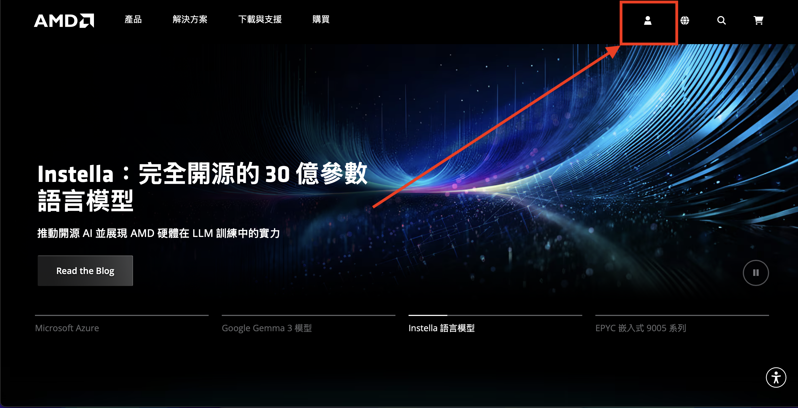
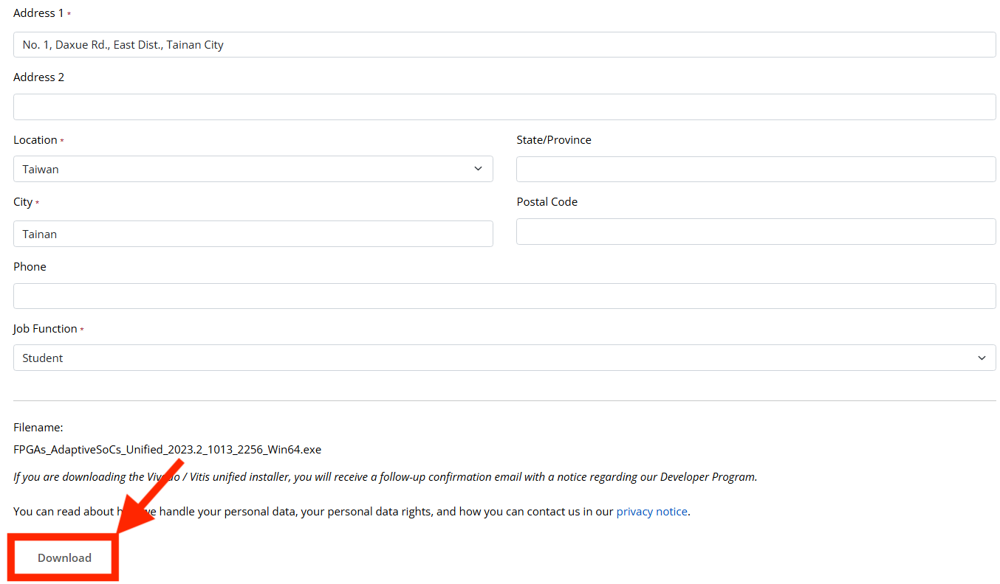
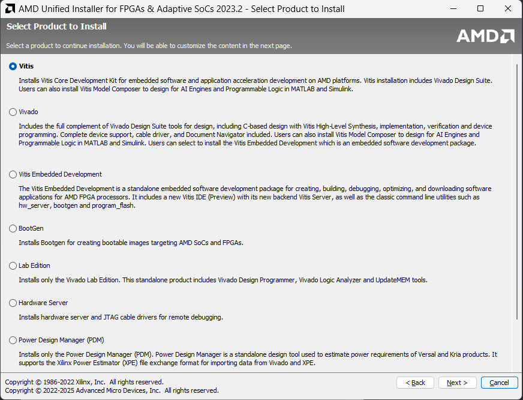
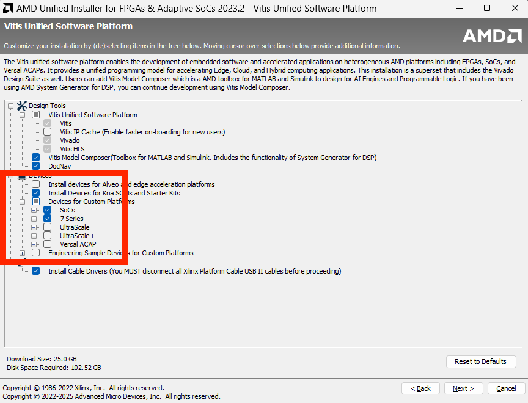
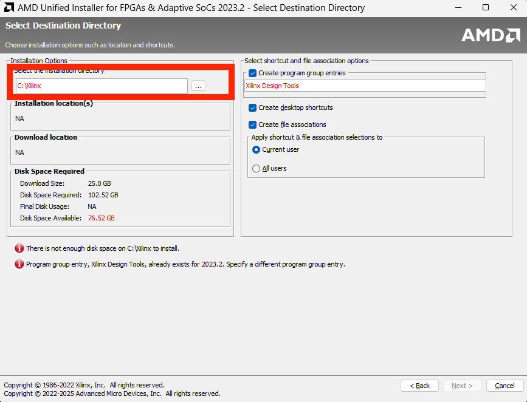
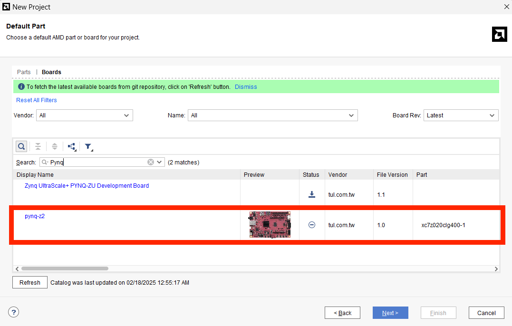

# Vivado Installation Guide

## Part 1. AMD account registration

1. 前往 [AMD 官網](https://www.amd.com/zh-tw.html) 申請帳號

    

2. 申請好 AMD 帳號並登入後，回到官網點選上方 `下載與支援` -> `Vivado ML 開發工具`

    

3. 選擇 `2023.2` 版本，之後的教學基本上都以 `2023.2` 為主

    
    

    **填寫完資訊**後按 Download

    

4. 點開剛剛下載好的檔案並登入剛才註冊的 AMD 帳號

    

    選擇 `Vitis` 安裝整套工具包含軟體 `Vitis` 硬體 `Vivado` 的整合開發套件

    

    根據自己使用的 FPGA 板選擇對應的 Device:

    - `KV260` -> Kria SOMs and Starter Kits
    - `Pynq-Z2` -> SoC and 7 Series FPGAs
    - `Zedboard` -> SoC and 7 Series FPGAs

    可以只選擇你需要用的 FPGA 板去做安裝，如果也安裝 Ultrascale 會使用到較多的空間

    

5. 安裝路徑請一定不要有**中文**在內

    

6. 等待下載完成就安裝好 Vivado 了，恭喜你後面就是痛苦的開始d(`･∀･)b

## Part 2. FPGA Board file installation

如果之後建立 Project 選擇 Boards 時沒有你所使用的 FPGA 板，請參考以下步驟安裝 FPGA 開發板的檔案，這邊以 Pynq-Z2 為例。

1. 假設在選擇板子時沒有看到 Pynq-Z2 的 Board

    

2. 前往 Pynq-Z2 的[官網](https://www.e-elements.com.tw/en/products-en/xup-pynq/pynq-z2/)下載 `FPGA Board File` 和 `.XDC`

    - `Board File`: 個檔案能讓你在 Vivado 裡直接選 PYNQ-Z2 這塊板子當 target board，並自動填入正確的：
        - FPGA 腳位對應（例如 HDMI、音訊、LED、Pmod 接口等）
        - Zynq 處理器 preset 設定（包括時脈、RAM 配置等）

    - `Master XDC`: 內部有所有腳位對應的 XDC 檔案，該檔案會告知 compiler 將 verilog 宣告 port 連接到實體的 pin 腳上。

    

3. 將下載好的檔案解壓縮，並將 Borad File (.xdc不用) 資料夾放入 Vivado 的 Board File 路徑中

    Vivado File path:

    `C:\Xilinx\` > `2023.2\` > `data\` > `xhub\` > `boards\` > `XilinxBoardStore\` > `boards\` > `Xilinx\`

    

    之後按下 `Refresh` 或是重新打開 Vivado 創建 Project 時就能看到 Pynq-Z2 的 Board 了

    
