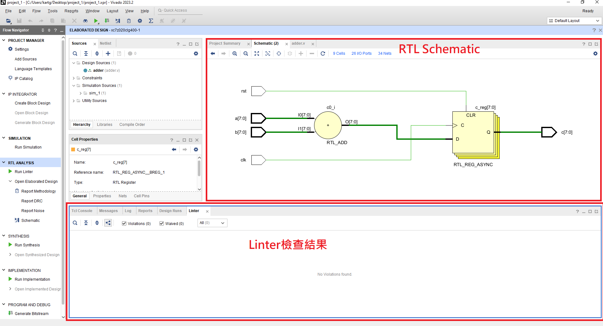

# Extra1 Linter

在 `2023.2` 版本中，Xilinx 新增了 `RTL ANALYSIS` 的功能，可以協助檢查 RTL 語法， Linter 會分析所有加入 Design Sources 的 Verilog/VHDL 檔案；檢查語法正確性、語意錯誤、潛在問題（如 combinational loop、未連接的訊號等）

- 不經 Synthesis 直接在 `Open Elaborated Design` 中看到 RTL 架構圖
- 透過 `Run Linter` 對展開後的邏輯進行靜態分析（如：combinational loop、未使用 bit）

> **_NOTE:_** 為什麼沒 Synthesis 也能看到電路圖？
>
> Vivado 的 `Run Linter` 和 `RTL Viewer` 所產生的電路圖，並不是實際 Synthesis 的結果，而是透過 **Elaborated Design** 所建立的模組結構圖。
>
> **Elaborated Design** 是 Vivado 在 **Functional Simulation** 階段根據原始 RTL 程式（Verilog/VHDL）做靜態分析後，
> 將 `module`、`always`、`assign` 等邏輯自動建構成結構化圖形。
>
