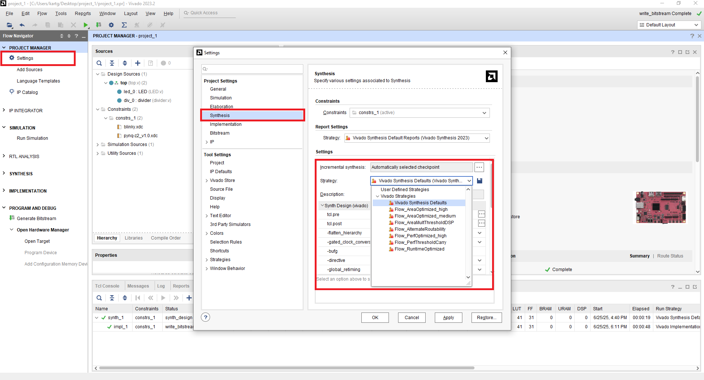

# Extra2-Synthesis-and-Implementation-Strategies

Vivado 在執行 `Synthesis` 和 `Implementation` 時，提供了多種可選的 **Strategy（策略）**，  
這些策略會影響合成與實作階段使用的演算法與優化方向，例如：

- **資源使用率（LUT / FF / DSP 使用量）**
- **Timing 收斂能力（是否更容易達成時序要求）**
- **功耗最佳化（低功耗 vs 高性能）**
- **編譯時間長短**

這些策略會根據設計的不同需求（例如高速 vs 小面積）進行優化調整。

## Synthesis

## Implementation

