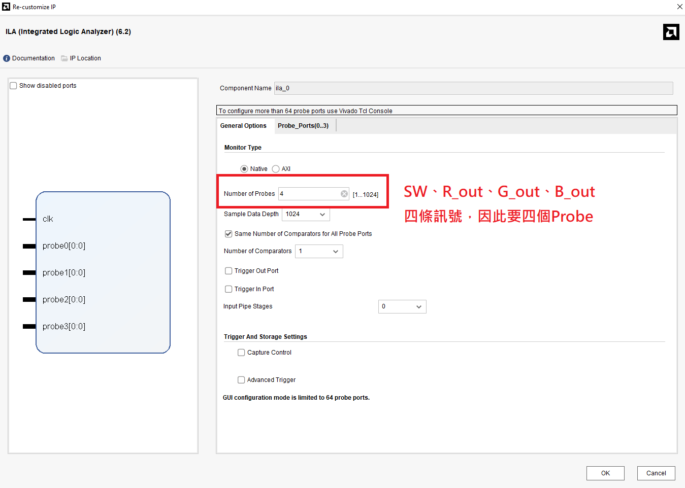
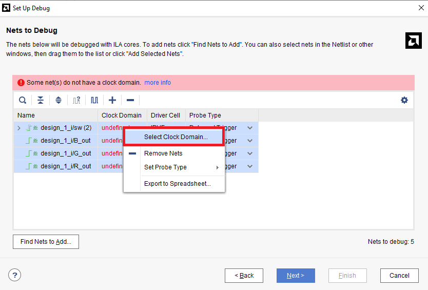
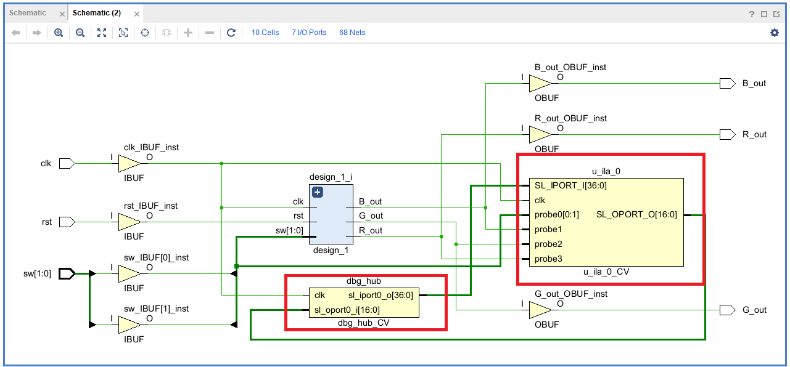
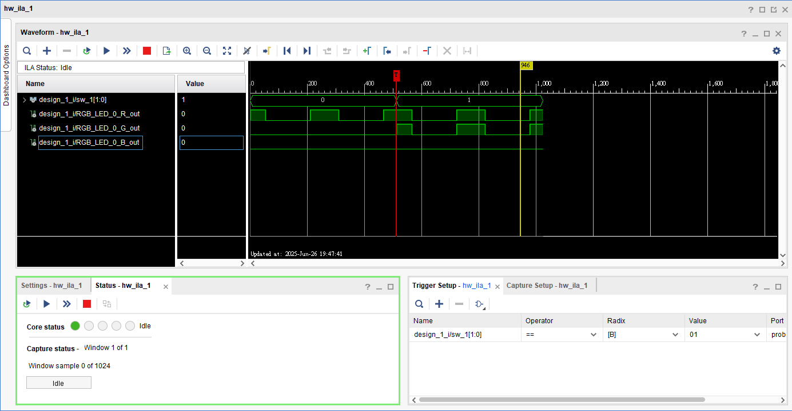
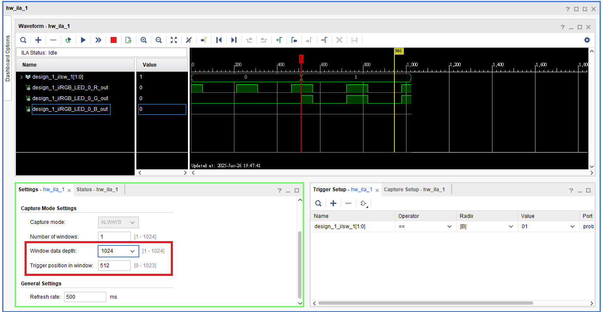
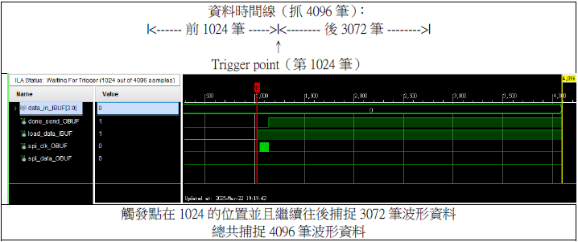
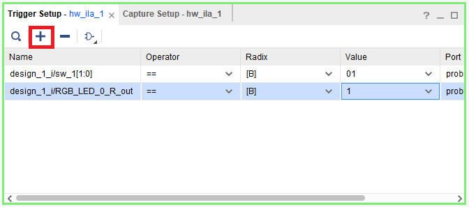
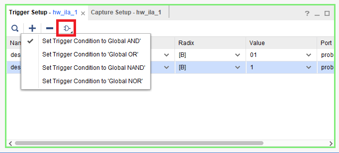

# Extra4-Debugger

本章將介紹如何在 Vivado 中使用 **ILA（Integrated Logic Analyzer）** 進行 **FPGA 硬體偵錯**。  
透過 ILA 工具，我們可以在電路實際運行於 FPGA 上時，觀察內部訊號的變化，協助排除模擬階段無法捕捉的問題。  

## Extra 4.1 ILA Block Design

1. 沿用 `Part4-2` 的 Block Design，在 Vivado 提供的 IP Catalog 中搜尋 `ILA`，將其加入設計中。

    

2. 對 `ILA` 點右鍵選取 `Customize`後，根據以下步驟設定

    
    

3. 依照下圖方式對 `ILA` 做連接，接完線後做一次 `Regenerate Layout` 和 `Validate Design` ，以確認沒有錯誤  

    

4. 驗證沒問題後，在左方 Design Sources 內的 block design 項目按右鍵，選擇 `Create HDL Wrapper`
然後執行 `Synthesis -> Implementation -> Generate Bitstream`
並將 Bitstream file 燒錄進 FPGA

5. 可先跳到 `Extra 4.3` 觀看 `ILA Waveform`，`Extra 4.2 Mark Debug` 為另一種設定方法

## Extra 4.2 Mark Debug

1. 將 `Part4-2` 的電路拿去合成後，點選左側 `Open Synthesized Design -> Schematic`  

    

2. 假設我們要觀察 `RGB LED 給出的三個 Output`、以及 `PWM_Decoder 的 sw 訊號`，將 Schematic 中 `design_1` 左上角的 + 點開並找到我們要看的四條訊號線，按住 Ctrl 選擇這四條線使其變成藍色後，在其中一條線上按右鍵，點選 `Mark Debug`

      

3. 點選左側 `Open Synthesized Design -> Set Up Debug`  

      

4. 在 `Clock Domain Undefined` 的地方右鍵，選擇 `Select Clock Domain`  

    

5. 選擇 `clk_IBUF`

      

    完成後如下圖  

    

6. 設定 `Sample Data Width`  

    

7. 設定完成後再重新 Synthesize 一次，再打開 Schematic 會發現多了兩個 Debug Blocks  

    

8. `Implementation -> Generate Bitstream`，並燒錄到 FPGA 上

## Extra 4.3 ILA Waveform

1. `Extra 4.1` 和 `Extra 4.2` 的電路燒入進去 FPGA 後，`Debug Probes` 視窗將會開啟，若沒有的話請點選 `Window -> Debug Probes`  

    

2. 接著我們要設定 Trigger 條件，假設我們 Trigger 的條件為 sw == 2'b01
在 Trigger Setup 的視窗點選 + 號將 sw 訊號加入，然後對其做設定  
    

3. **此時先把 FPGA 版上的 `sw0` 和 `sw1` 都撥到零的位子後**，點選 `Run Trigger for this ILA core`  

      

    若你有照上方所說**先把 FPGA 版上的 `sw0` 和 `sw1` 都撥到零的位子**，此時會在 `Wait for Trigger` 的狀態，此時 `ILA` 會一直紀錄數值直到我們把 `sw0` 撥到1的位置就會被觸發

    

    `sw0` 撥到1的位子隨即觸發，並在上方波型圖顯示觸發前後的波型  

      

### Capture Mode Settings

| 名稱 | 意思 |
|--------------------------|-----------------------|
| Sample of data depth | 在建立 ILA core 時，設定的 Sample of data depth。它會變成 ILA 的硬體參數 `C_DATA_DEPTH`。 |
| Window data depth | 在 ILA 實際抓資料時，一次要抓多少筆資料。上限就是 sample of data depth。|
| Trigger position in window | 設定「觸發點在這次擷取的哪個位置」，這會決定擷取多少資料是在「觸發點之前」與「觸發點之後」。|

1. `ILA IP` 自訂時可以選擇 `Sample Data Width`，深度開得越大，使用的 `FPGA BRAM` 資源就越多， `ILA IP` 儲存 Capture 的資料主要就是使用 `BRAM`  

    

2. `ILA` 開啟後可以透過調整左下角的 `Window data depth` 或 `Trigger postition in window` 來去調整你要紀錄 Trigger 前後多少的資料  

    

3. For Example:  

      

    

### Trigger Mode Settings

1. 透過 `+` 號可以增加 Trigger 的條件，可以複數條 Trigger 條件同時存在

    

2. 點選上方 `邏輯閘` 可以選擇下方的條件要在如何的 Boolean 條件下發生 Trigger
    

>📌 Note：  
>
> - 若訊號為高速 clock domain，建議先經過 D Flip-Flop 進行觸發延遲再接入 ILA  
> - ILA 必須由 **free-running clock** 驅動，確保時脈不會被 gating、reset、或控制邏輯中斷  
> - 避免使用 gated clock 或條件性 enable 的 clock 作為 ILA 的 clock source  
> - 若觀察跨 clock domain 訊號，請先將其同步處理後再接入 ILA，以避免 metastability
>
>📌 Free-running clock：
>
> - 不會被設計中的控制訊號（如 enable/reset）中斷的時脈  
> - 與被觀察訊號在同一個 clock domain 或可被同步跨域  
>
>Free-running clock Example in PYNQ-Z2 :
>
> - 系統主時脈( H16 pin in PYNQ-Z2 ): clk_125MHz  
> - Zynq PS 送出的 FCLK_CLK0
