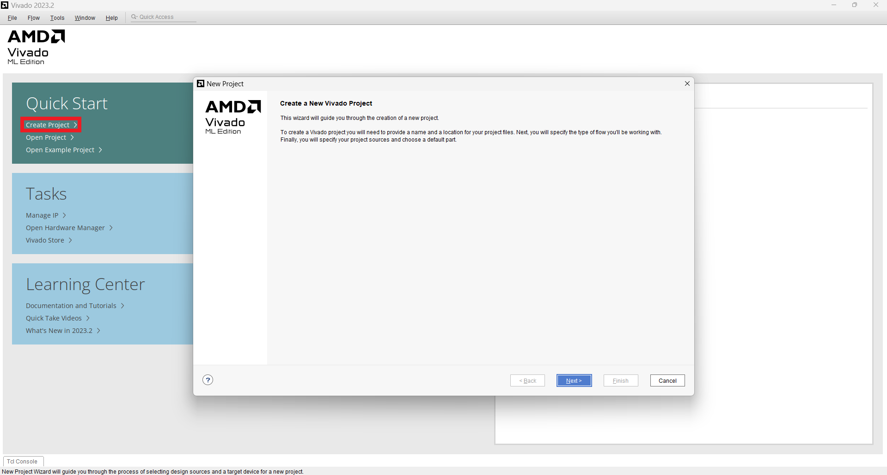
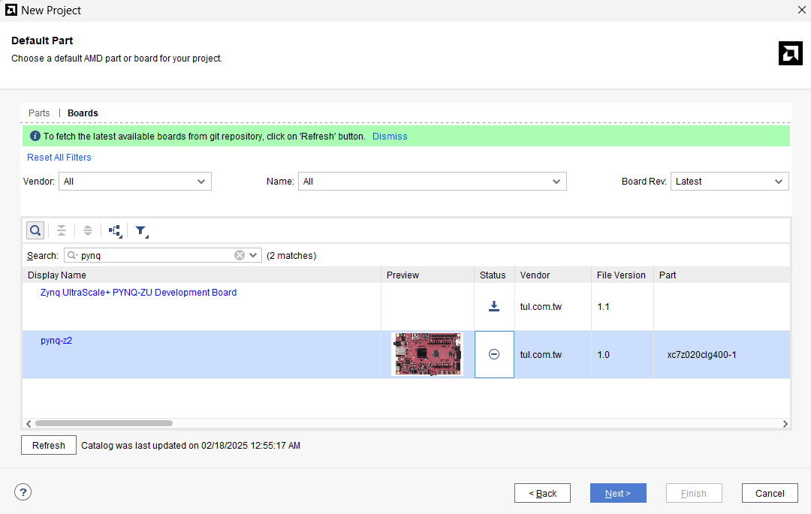
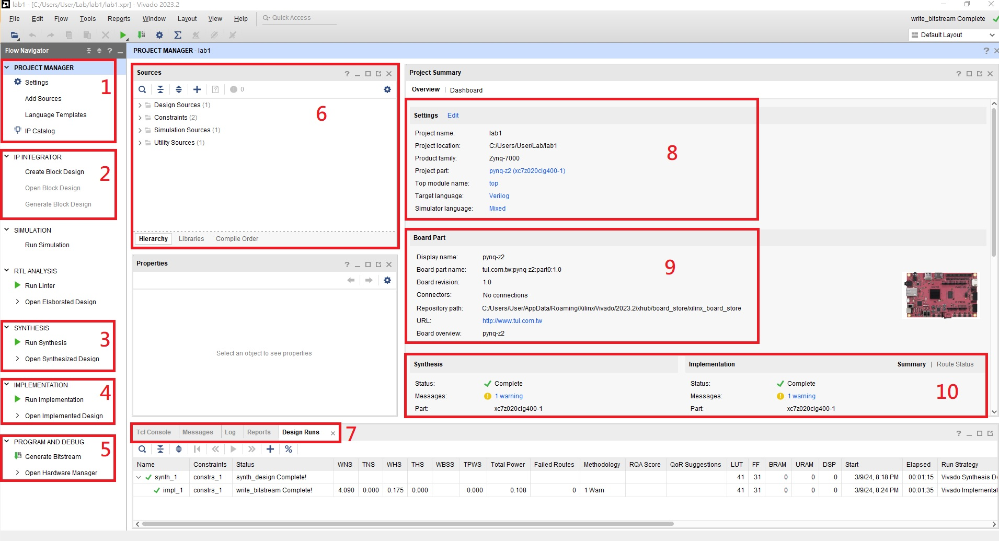

# Part1 Vivado Basic Tutorial

## Part 1.1 Create Vivado Project

1. 開啟 Vivado 並且按下 Create Project

    

2. 自行選擇路徑，注意路徑不能出現**中文**

    

3. 選擇 RTL project ，若有寫好的 RTL code 則不必勾選 `Do not specify sources at this time`，可以在此階段將 RTL code 跟 Design Constraint import 進 project 中

    

4. 選擇 FPGA Board ，這邊以 Pynq-Z2 做舉例

    

5. 若成功建立 Project 後，Vivado 將顯示下方的畫面

    

## Part 1.2 Introduction to Vivado Gui

1. **Project Manager**

    整個 Project 的管理包括了 : 檔案管理 , 專案設定 , IP資料夾路徑等等，後續到了其他的設計階段(e.g. synthesis / implementation )要回到修改程式或新增檔案的部分都需按 `Project Manager` 回去才可以做修改。

2. **IP Integrator**

    以 `Block Design` 的方式來兜出整個系統，且可以加入 Xilinx 或是第三方所提供的 IP 來實作整個系統的設計

3. **Synthesis**

    將設計好的硬體描述檔合成成 FPGA 上由 CLB , Switch Box , Embedded Element 等元件所組成的實際電路

4. **Implementation**

    將合成好的實際電路擺放到 FPGA 上的確切位置 (Floor & Plan)

5. **Program and Debug**

    Generate Bitstream : 將 Implementation 完的電路編譯成一個燒錄進 FPGA 的位元串流檔

6. **Sources**

    管理 `Design Sources` , `Constraints` , `Simulation Sources`

7. **Tcl Console**

    使用指令的方式來實作 Project (在 GUI 上每個點選的動作其實都有相對應的一條指令，也會顯示在這邊)

    - Message : 任何系統訊息, warning, error 都會顯示在這，若在實作 project 時卡關建議先到這裡找問題

    - Log : 紀錄 Project 歷程

    - Reports : 回報 synthesis & implementation 如 timimg, power, utilization 等資訊

    - Design Runs : 顯示軟體現在正在進行什麼步驟

8. **Project Summary**

    完成 Create Project 後， Vivado 會顯示如圖所示的專案基本設定，包括：

    - Project name
    - Project location
    - Product family / Project part
    - Top module name

9. **Board Part**

    目前使用的 FPGA 資訊

10. **Synthesis & Implementation Summary**

    顯示 Synthesis 與實作 Implementation 的狀態，包括：

    - Status
    - Warning 訊息數量
    - 使用之晶片型號（Part: xc7z020clg400-1）
