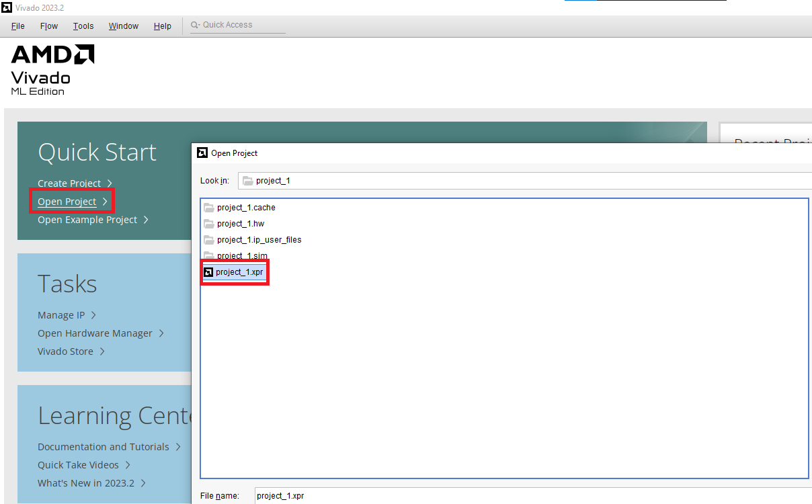
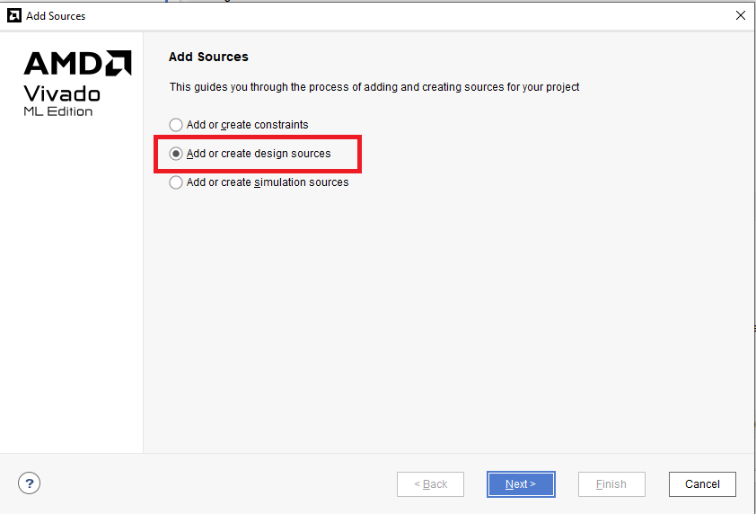
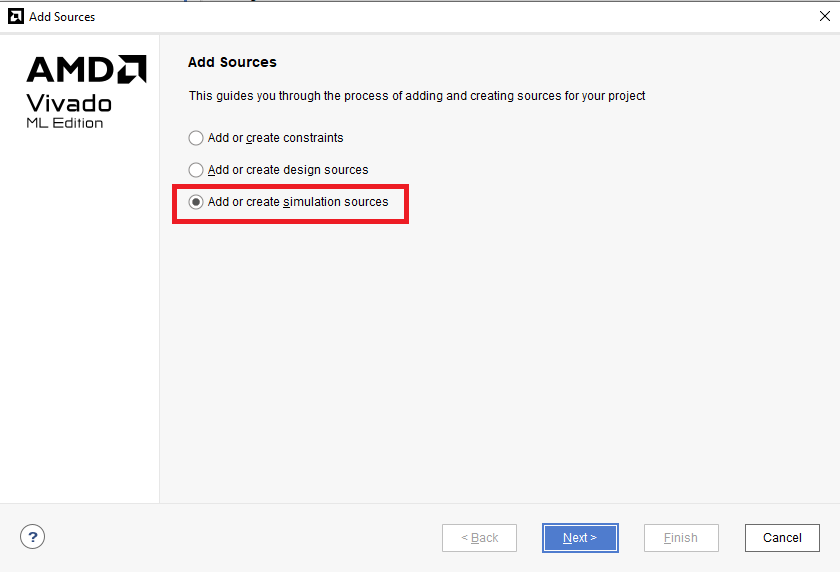
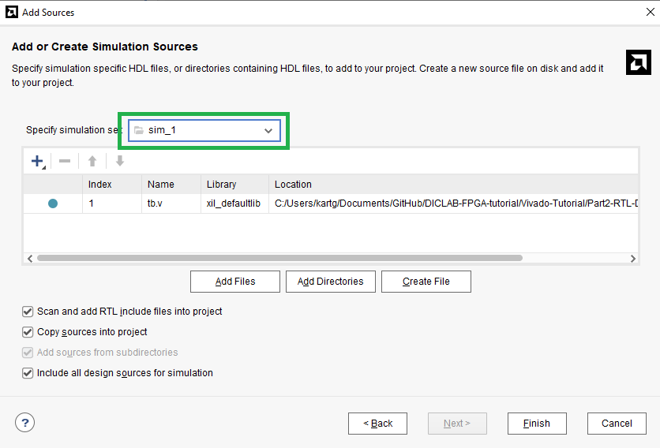

# Part2 RTL Design Simulation

本節將介紹如何在 Vivado 中匯入已寫好的 RTL 程式與 Testbench，並進行模擬驗證。

開始前請先參考 [Part1 Vivado Basic Tutorial](../Part1-Vivado-Basic-Tutorial/README.md)
建立一個 Vivado Project

假設我們已經有一個簡單的加法器程式 `adder.v`，以及對應的 Testbench `tb.v`：

<details>
<summary>adder.v</summary>

```verilog
module adder(
    input clk,
    input rst,
    input [7:0] a,
    input [7:0] b,
    output reg  [7:0]   c
    );

always @(posedge clk or posedge rst) begin
   if (rst)
     c <= 0;
   else
     c <= a + b;
 end

endmodule
```

</details>

<details>
<summary>tb.v</summary>

```verilog
module tb ();
    //Inputs
    reg clk;
    reg rst;
    reg [7:0] a;
    reg [7:0] b;
    //Output
    wire [7:0] c;

    adder adder_i   (
        .clk(clk),
        .rst(rst),
        .a(a),
        .b(b),
        .c(c)
    );

    initial begin
        //Initialize
        clk = 0;
        rst = 0;
        a = 0;
        b = 0;
        #10;
        rst = 1;
        #10;
        rst = 0;
        #100;
        a = 4;
        b = 7;
        #10;
        a = 8;
        b = 17;
    end

    always #5 clk = ~clk ;

endmodule
```

</details>

## Part 2.1 Open Project and Add Source File

1. 開啟 Vivado，點選左邊選單中的 `Open Project`

2. 找到 Project 的資料夾，選取副檔名為 `.xpr` 的檔案（例如 `project_1.xpr`）並開啟

    

3. 在 **Flow Navigator** 中點選 `Project Manager` → `Add Sources` 或從 `Source` 區塊點選 `+`

    

4. **Add Source 選單：**

   當你點選 `Add Sources` 後，會出現如下圖的畫面，Vivado 提供三種不同類型的檔案加入方式：

   - `Add or create constraints`

     用來新增或建立 `.xdc` 檔案（約束檔），指定 **IO 腳位與時序條件**。常在專案後期或實作階段使用。

   - `Add or create design sources`

     加入你的 RTL 程式（`.v`、`.vhdl`）。

   - `Add or create simulation sources`

     加入 Testbench 檔案（例如 `tb.v`），這些檔案只會用於模擬階段，**不會參與 Synthesis** 。

    1. 在本節中先選擇 `Add or create design sources`

        

    2. 將 `RTL` 資料夾內的 `adder.v` 加入當中，之後點選 `Finish`

        

    3. 再重複操作一次選擇 `Add or create simulation sources`

        

    4. 將 `RTL` 資料夾內的 `tb.v` 加入當中，之後點選 `Finish`

        

    > **Note:**
    >
    > 可以透過 Simulation Set 管理多組 Simulation 設定，例如不同的 Testbench 或模擬條件。
    >
    > 本節使用預設的 `sim_1`，並將 RTL 資料夾內的 `tb.v` 加入即可。
    >
    > 未來在設計較大型的電路時，可以根據不同的 module 建立對應的 Simulation Set，方便進行模組化測試與除錯。

## Part 2.2 Run Simulation

1. 確認模擬相關設定是否正確：點選左上角的 `Project Manager` ，再點選 `Settings`

    `Simulation set` 的地方選擇剛剛設定的 `sim_1`

    

    - **Target simulator**: 選擇 `Vivado Simulator`
    - **Simulator language**: 選擇 `Mixed` 或 `Verilog`
    - **Simulation set**: 預設為 `sim_1`，可切換成其他 Simulation Set
    - **Simulation top module name**: 輸入你的 Testbench 名稱（例如 `tb`）

    > **_NOTE:_**
    >
    > 一個 Simulation Set（例如 sim_1）是 Vivado 中用來設定一組 simulation 環境的集合。
    > 每組 Simulation Set 都可以對應：
    >
    > - **一份或多份 Testbench**
    > - **一個 Top Module**

2. 點選左側的 `Simulation` 選擇 `Run Behavior Simulation`

    

3. 操作正確就可以看到如下方的波型圖

    

## Additional

[Extra1-Linter](../Extra1-Linter/)
