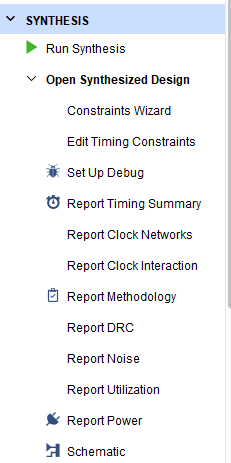
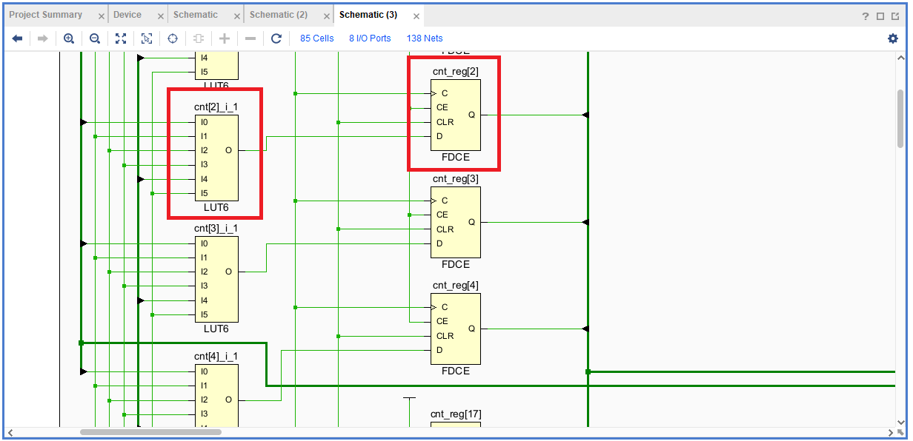
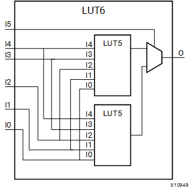
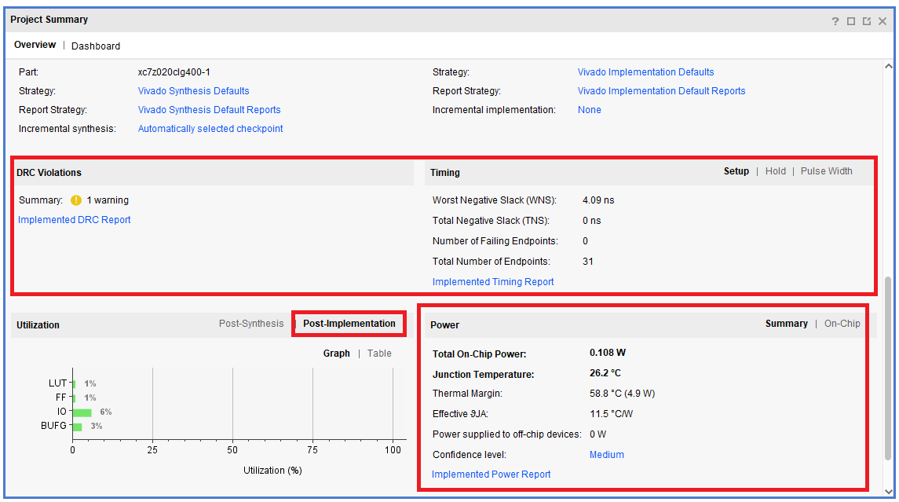
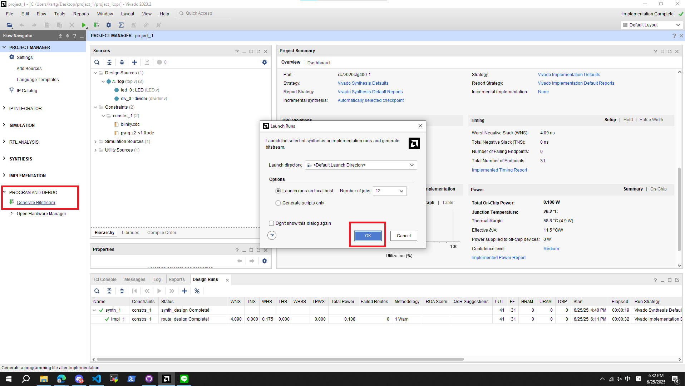
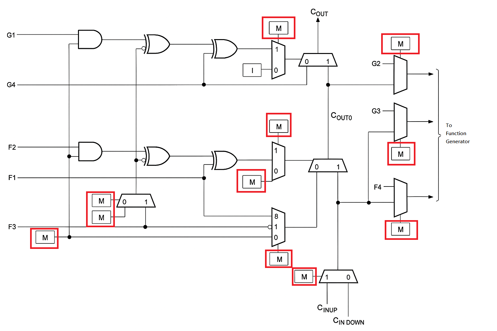
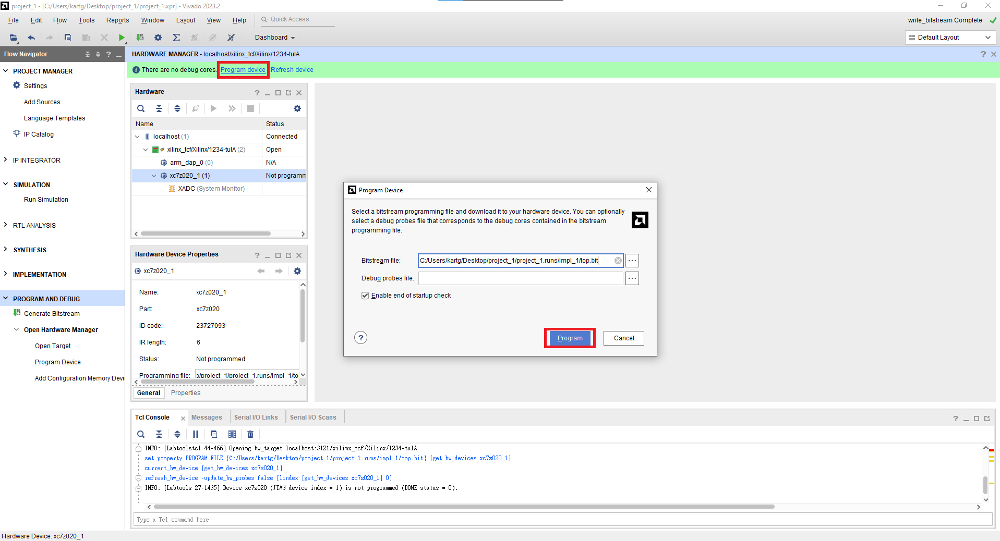

# Part3 FPGA Design Flow

Xilinx FPGA 設計流程可以分為以下 6 個步驟：

1. **RTL Design**

    - 使用 Verilog/VHDL 撰寫 module

2. **Behavior Simulation**

    - 透過 Testbench 測試功能邏輯是否正確

3. **Synthesis**

    - 將 RTL 轉換為邏輯元件（如 `LUT`、`FF`、`MUX`、`CLB` 等），輸出成 Netlist

4. **Implementation**

    - 包含 **Placement** 與 **Routing** 兩個階段，將合成後的邏輯元件實際配置到 FPGA 上，如 `CLB`、
    `Routing Channel`、`IO Bank` 等

5. **Generate Bitstream**

    - 產生 bitstream (`.bit`) 檔，以供燒錄到 FPGA 中

6. **Program & Debug**

    - 將 bitstream 燒入至 FPGA，並使用 ILA (Integrated Logic Analyzer) 等工具進行邏輯分析與即時驗證

> [!NOTE]
> **Synthesis 電路合成**
>
> Synthesis 負責將 RTL 程式轉換成可由 FPGA 實際執行的邏輯元件，例如
> LUT (Look-Up Table)、Flip-Flop、MUX 等。
>
> Synthesis 的輸出是 **Netlist**，描述了邏輯元件之間的連接關係，
> 供下一步的 Implementation 階段使用。

<nobr>

> [!NOTE]
> **Implementation 電路實作**
>
> Vivado 在 Implementation 階段會做以下兩個工作：
>
> - **Place Design**: 將邏輯元件放置到 FPGA 上的具體位置
> - **Route Design**: 完成所有訊號間的連線，並考量時序要求

<nobr>

> [!NOTE]
> **FPGA 與 ASIC Synthesis 的差異**
>
> 雖然 FPGA 與 ASIC 皆是使用 RTL（Verilog/VHDL）程式來合成，但因為兩者的目標硬體架構不同，導致合成結果有所差異：
>
> **FPGA Synthesis**：
>
> - 目標為 FPGA 元件，如 `LUT`、`FF`、`BRAM`、`DSP` 等
> - 合成結果會映射到 FPGA 上面真實存在的實體邏輯資源
>
> **ASIC Synthesis**：
>
> - 目標為 **Standard Cell Library**，如 `AND2_X1`、`DFF_X1` 等
> - 產出 gate-level netlist 與 SDF 延遲檔，供 Place & Route (P&R) 與
> Gate-level simulation 使用

## Part 3.1 Add Design Source / Constraint Files

1. 參考 [Part 1](../Part1-Vivado-Basic-Tutorial/README.md) 建立一個新 Project

2. 將 `/RTL` 與 `/xdc` 目錄下的檔案加到 project 中，可參考
   [Part 2](../Part2-RTL-Design-and-Simulation/README.md)

    - 點選 `Add or create design sources`，加入 `/RTL` 內的 `top.v` `LED.v` `divider.v`
    - 點選 `Add or create constraints`，加入 `/xdc` 內的 `blinky.xdc` `pynq-z2_v1.0.xdc`

3. 成功的話 Project Hierarchy 應該會如下所示：

    

> [!NOTE]
> **Constraint 的用途**
>
> 在 Xilinx FPGA 中，**Constraint** 檔案副檔名為 `.xdc`，他的主要功能是定義設計的時序與 I/O 限制：
>
> - **Clock Constraints**： 定義時脈的頻率與來源，例如 `create_clock`
> - **I/O Pin Assignment**：定義實體腳位對應的 signal，例如將 `clk` 對應到 `W5`
> - **I/O Standards**：設定電壓與訊號標準，如 `LVCMOS33`
>
> Constraint 是 **Implementation** 階段中 *時序分析*、*資源配置* 的重要依據。
>
> 若沒有正確的 `.xdc`，Vivado 可能無法正確佈線，造成 **Timing Violation** 等問題。

<nobr>

> [!TIP]
> **Constraint Set**
>
> Vivado 支援使用 Constraint Set 來管理多組時序與 I/O 限制設定
>
> 未來在面對大型設計時，可以根據不同模組與需求建立對應的 Constraint Set，進行驗證與切換設計條件。

## Part 3.2 Synthesis

1. 執行 **RTL Synthesis**：點選左側 `SYNTHESIS` → `Run Synthesis`

    在彈出的設定視窗中，Vivado 會詢問你希望分配多少執行緒來執行合成。

    可以依照自己電腦的 CPU 核心數選擇，分配越多執行緒，Synthesis 所需時間通常會越短。

    

2. 檢視合成後的結果：Synthesis 完成後，可以點擊左側 `SYNTHESIS` → `Open Synthesized Design`

    

    
Synthesis Report

    

    - **Report Timing Summary**：預估時序是否符合目標頻率
    - **Report Utilization**：預估使用多少 CLB、LUT、FF 等邏輯資源
    - **Report Power**：估算功耗
    - **Report DRC (Design Rule Check)**：檢查邏輯結構是否存在問題

    

> [!WARNING]
> 因為尚未經過 Placement 與 Routing，缺少實體路徑與實際延遲，因此 Timing 類報告只是基於 Netlist 的預估

3. 檢視 Synthesis 後的電路：點選左側的 `SYNTHESIS` → `Open Synthesized Design` → `Schematic`

    

    
Schematic

    

    - **LUT6** (6-input Look-Up Table)

        - LUT 是組成 FPGA 設計邏輯的核心之一，Vivado 會自動將 RTL 中的邏輯運算映射為 LUT
        - LUT6 有 6 個輸入，可以實現任何 6-input 的布林函數

        

    - **FDCE** (Flip-Flop with D input, Clock, Clear, Enable)

        - 帶有 Clear 與 Enable 訊號的 D 型正緣 Flip Flop

        
    

4. 點選左上方 `Project Manager` 後跳出的 `Project Summary` 可以看到 Utilization，
   其他資訊則要等到 **Implementation** 後才能看到

    

    
Project Summary

    
    

## Part 3.3 Implementation

1. 執行 **Implementation**：點選左側 `IMPLEMENTATION` → `Run Implementation`

    

2. 檢視電路實際擺放位置：Implementation 完成後，點選左側的 `IMPLEMENTATION` → `Open Implemented Design`

    

    
Implemented Design

    
    

3. 在 **Project Summary** 中可以看到 Implementation 的結果，包含 Timing、Utilization、Power 等資訊

    

    
Project Summary

    
    

> [!NOTE]
> **Implementation** 階段 Vivado 會統整出:
>
> - **Power Estimation**：預估功耗
> - **Timing Analysis**：分析 Setup/Hold Timing 是否滿足設計要求
> - **DRC（Design Rule Check）**：檢查佈線、資源使用是否符合規則
> - **Utilization Report**：彙整資源使用情況（LUT、FF、BRAM 等）
> - **Schematic Viewer**：可查看實體配置後的電路圖

## Part 3.4 Generate Bitstream

1. 生成 Bitstream：點選左側 `PROGRAM AND DEBUG` → `Generate Bitstream`

完成後會有以下畫面

> [!NOTE]
> **Bitstream**
>
> Bitstream (`.bit` / `.bin`) 是一個二進位檔案，供燒錄到 FPGA 中
>
> 其中包含了 FPGA 的配置資料：
>
> - 邏輯元件的對應與連接 (from Netlist)
> - Placement & Routing 結果
> - I/O 配置與 Constraint (from `.xdc`)
>
> 下圖為 XC4000 系列的 Fast Carry 硬體架構。
>
> 
>
> 可以看到圖中 M 代表多工器（MUX），Bitstream 會被用來控制這些 MUX 的選擇路徑
>
> 藉此設定每個邏輯元件與連線的實際行為與配置

## Part 3.5 Program to FPGA

1. 將 FPGA 與電腦連接 (將 Micro USB 插上 Port 2)

2. 將 8 號區的 Jumper 插至 `JTAG` 的位置

    > [!NOTE]
    > **JTAG (Joint Test Action Group)**
    >
    > JTAG 是一種標準的 Debug 與燒錄介面，主流 FPGA（如 Xilinx、Intel）都支援此標準。
    >
    > FPGA 在使用 `JTAG` 模式下進行配置時，會根據 IEEE 1149.1 標準進行串列資料傳輸。
    >
    > 可將我們的 Bitstream 透過 `Boundary-Scan` 的方式燒入進去板子中

3. 打開開關 (3號區)

    > [!CAUTION]
    >**關機時一定要先關閉開關才可以拔除電源線**

4. 開啟 FPGA 後，回到 Vivado 並點選 `Open Hardware Manager` → `Open Target` → `Auto Connect`

    

5. 等待 Vivado 偵測到 `xc7z020` (Pynq-z2 所使用的 FPGA 晶片組) 後按下 `Program device` ，再點選 `Program`

    

6. 燒錄完成後，可以參考 RTL Code 觀察 Switch 和 LEDs 的關係

## Additional

[Extra2-Synthesis-and-Implementation-Strategies](../Extra2-Synthesis-and-Implementation-Strategies/)

[Extra3-Constraint](../Extra3-Constraint/)
