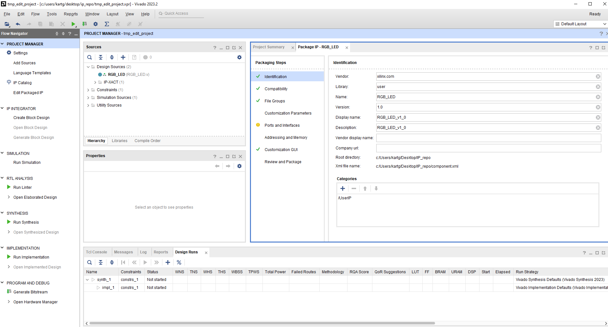
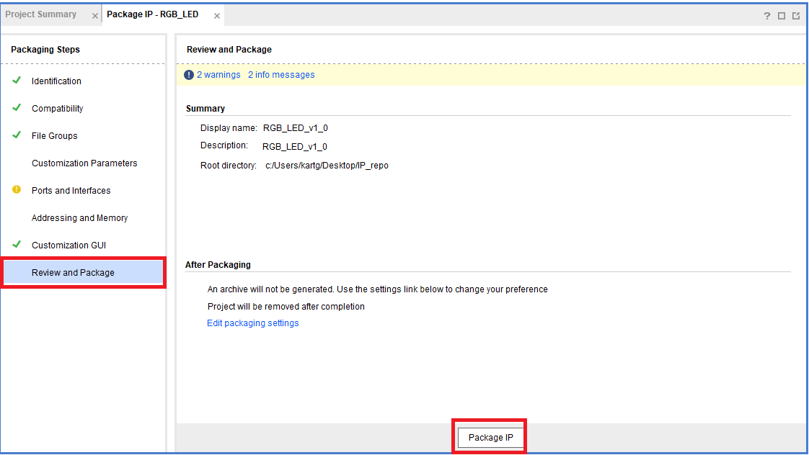
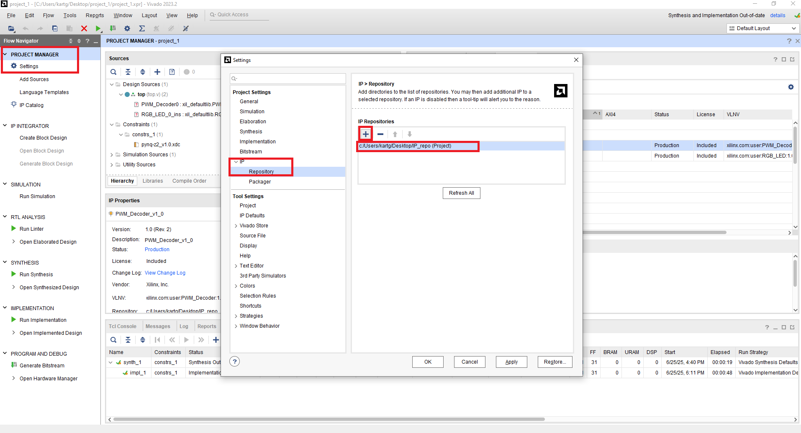
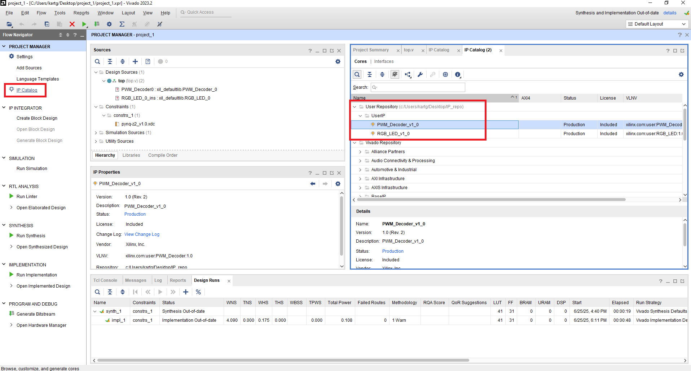
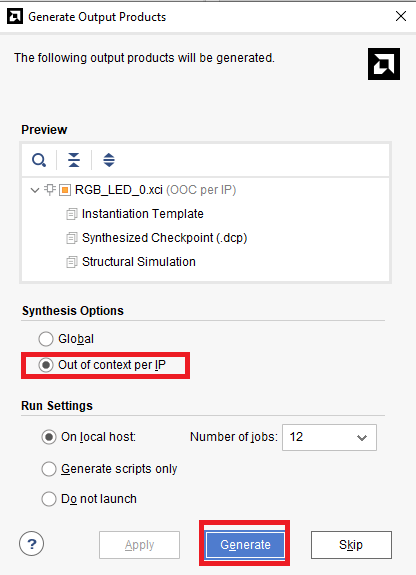
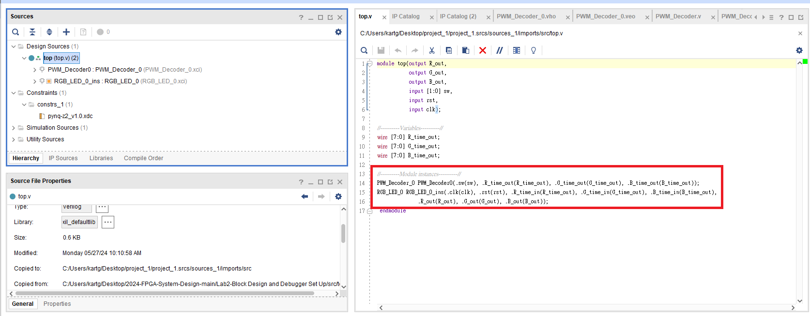

# Part4-1-IP-Package

## Hard IP / Soft IP 差異

在 FPGA 與 ASIC 設計中，常見兩種 IP（Intellectual Property）形式：

- **Hard IP**：  
  指已經經過 Placement and Routing 的電路模組，通常以實體電路形式嵌入在晶片中（如 Zynq 系列中的 ARM Cortex-A9 核心、DDR 控制器）。它的時序、面積與功耗特性固定，效能高但可攜性差。

- **Soft IP**：  
  軟 IP 是用 HDL 撰寫的模組，設計彈性高，可以在不同製程與平台上重新合成與實作。 Vivado 提供的大多數 IP 皆屬於 Soft IP，你可以看到它們通常會有 RTL 原始碼或是可以在 Synthesis 階段生成電路邏輯，就屬於 Soft IP。

在本教學中，我們將以 **Soft IP 的封裝流程為主**，學習如何將自己的 RTL 模組包裝成可在 Vivado Block Design 中使用的自訂 IP。

##  Design Constraints of IP

在 Vivado 封裝 IP 的流程中，Constraints 必須根據使用場景分開處理，主要分為兩種：

1.  Global
當 IP 是整個 SoC 設計的一部分時，IP 所需的時脈與 I/O 限制將由上層設計的 `.xdc` 提供，此時 IP 本身的 `.xdc` 不需要再定義 clock，否則可能產生重複定義錯誤

2.  Out-of-Context（OOC）
Vivado 預設會對每個 IP 執行 `OOC synthesis`，產生 `.dcp(design check point)` 
為了讓 IP 在 `OOC` 環境下能正確綜合，必須提供一份獨立的 .xdc 來定義：`create_clock`、`set_input_delay`、`set_output_delay`  

>📌 Out-of-Context（OOC）合成是指 Vivado 在 IP 尚未接入 Top-level design前，會單獨對該 IP 進行合成與分析。
在這個階段，Top-level 設計會將該 IP 視為一個 functional black box，不關心其內部邏輯細節，只關心其 interface 與功能行為是否正確。  
>
>📌 相對地，在 Global 設計情境下，**IP 被整合進整體系統**，由上層設計統一提供時脈與 I/O 限制，因此 IP 本身的 .xdc 中通常只保留必要的內部限制，並避免重複定義上層的 constraint。

3.  IP 封裝中的 Design Constraints 處理，在原始設計中，我們通常會針對 IP 做為獨立模組（standalone design）定義完整的 constraints。但當你將這個模組封裝為 IP 後，有些限制（像是 clock）會改由 Top-level design 提供，這時就需要將原始 XDC 檔拆成兩份：  

| 類型                         | 用途          | 是否需要獨立 clock 限制？     |
| -------------------------- | ----------- | -------------------- |
| **OOC (Out-of-Context)** | IP 單獨綜合時使用  |  需要（提供時脈資訊）         |
| **Top-level 設計中使用 (Global)**        | IP 被整合到主設計中 |  不需要（由上層 `.xdc` 提供） |

# Part 4.1.1 Package Your IP

1.  在包裝 IP 的過程中，有時候會需要開數個暫時拿來使用的 Vivado Project，這邊我們先創建一個新的 Vivado Project，並將`../RTL/RGB_LED.v` 和 `../XDC/RGB_LED_ooc.xdc` 加入專案當中

2.  將`RTL`跟`*OOC.xdc`加入專案後，照著後續操作調整`xdc`檔案的 **Properties**  

    
    

3.  修改完`xdc`的 Property 後，開始 Package IP，點選 `Tool -> Create and Package New IP` 

    
    

4.  將 `IP_repo/RGB_LED` 這個資料夾放在你想要的位子，之後要使用這些 IP 就需要**Import這個資料夾**  

    

5.  設定完成後 Vivado 會開啟一個 temp project 來做 IP 的包裝設定  

    

6.  點選 `Review and Package -> Package IP`  

    

7.  另外再重複一次上方的步驟包裝另一個新的IP，並只需加入 `/..RTL/PWM_Decoder.v`

##  Part 4.1.2 Instantiating the Packaged IP in RTL

1.  開啟一個 Vivado Project，並加入 `../RTL/top.v` , `../XDC/pynq-z2_v1.0.xdc`  

      

2.  上一步驟加入 `../RTL/top.v` 後，可以看到內部有宣告兩個我們先前的 IP ，但在File Hierarchy 裡面顯示為 `Not Found`，因此我們要將先前的 IP Import 進來並`Generate`，點選 `PROJECT MANAGER -> setting -> IP/Repository`  

    
    
3.  接著點選 `PROJECT MANAGER -> IP Catalog`，可以找到剛剛打包的 IP  

    

4.  對 `RGB_LED IP` 點兩下，並接續操作  

    
      
    
    選擇 `Out of context per IP`，然後點選 `Generate` 來進行 IP 的合成  

      

    >📌 先前在包裝該 IP 時我們設定即為 `OOC`，因此在 `Generate` 時選擇 `OOC` 進行 `Generate`  

5.  依照上述的步驟將 `PMW_Decoder IP` 也呼叫進來，然後在最後一步的 `Generate Output Products` 選擇 **`Global`**

      
    
6.  `Top.v` 內部的 IP 宣告名稱可以由 `IP Sources -> Your_IP_name -> Instantiation Template -> *.veo(verilog) / *.vho(VHDL)` 中找到要宣告的名稱跟 port  

    
    

7.  接著即可執行 `Synthesis -> Implementation -> Generate Bitstream`
(直接按下 `Generate Bitstream` 其實也會把前面兩步驟都一起做完)  
然後將 Bitstream file 燒錄進 FPGA。
