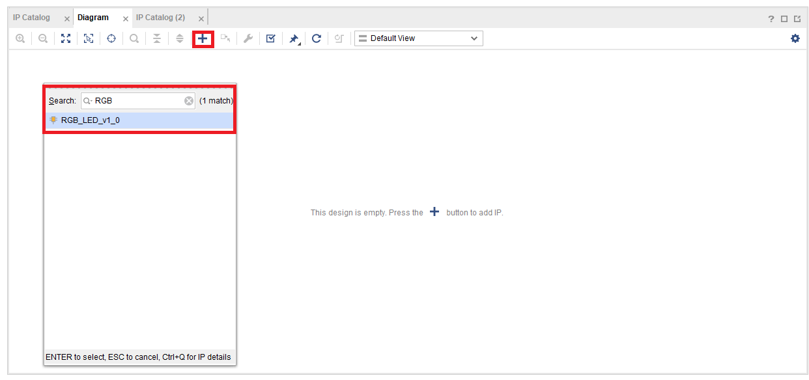
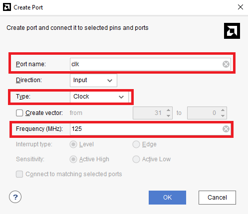
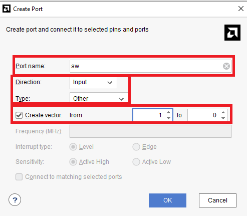
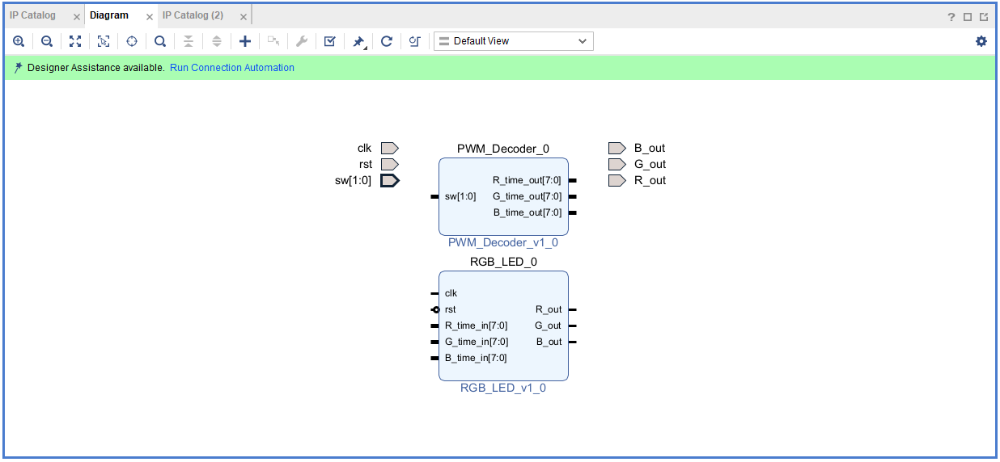
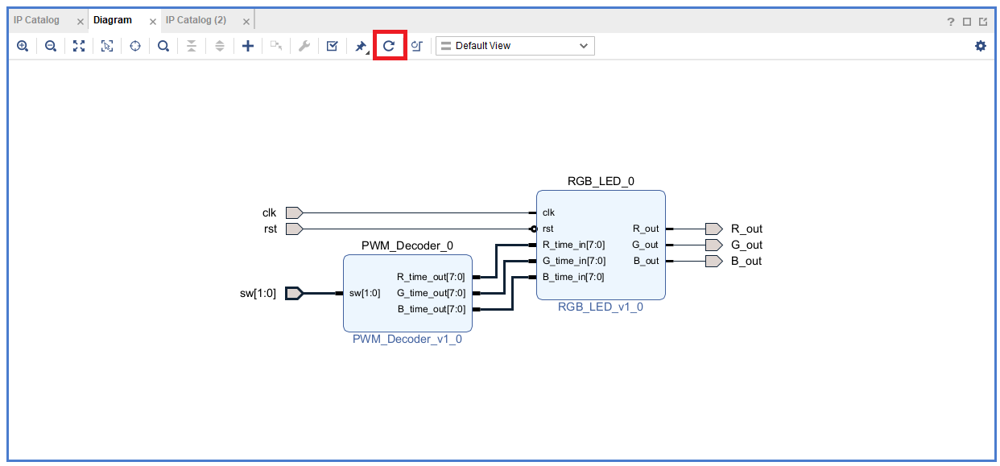
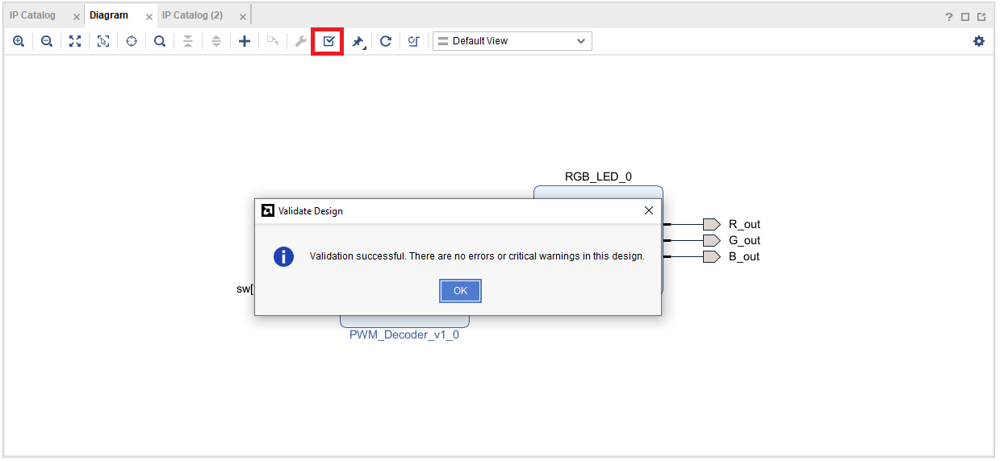

# Part4-2-Block-Design

本章節會使用你在 [`Part4-1-IP-Package`](../Part4-1-IP-Package/) 中封裝好的自訂 IP。  
請務必先完成 IP 包裝步驟，才能順利在 Block Design 中加入該 IP 進行連線與整合。

##   What is Block Design ?
Vivado 的 `Block Design` 是一個圖形化設計平台，可讓你使用拖拉方式將多個 IP （如 AXI IP、自訂 IP、Zynq PS 等）組合成完整系統。  
這大幅簡化了 RTL 連線與系統整合的複雜度，是進階 FPGA 開發的主流方式之一。  
>   你不會想要用寫 code 的方式去拉下面這張圖的 🙃  
>
>

## Part 4.2.1 Create Block Design  

1.  新創一個 Vivado Project，先照著 `Part4.1.2` 的方式將 `IP_repo` import進來該 Project

2.  點選左側 `IP INTEGRATOR -> Create Block Design`，Block Design 的名稱可以自己取名  

      

3.  可以透過左側 `IP catalog` 或是 `Block Diagram中的 + ` 去做新增IP到Block Design的動作，我們先將在 `Part4.1` 中做好的兩顆 IP 都加入到 Block Design 當中  

    **IP Catalog** 依序將兩顆 IP 皆加入:  

      

    **Block Diagram中的 +** 依序將兩顆 IP 皆加入:  
     

4.  加入完成後會如下圖所示  

      

5.  接下來要幫電路接線，設定 I/O Ports， **在空白處 右鍵 -> Create Port** ，製作以下 Ports

      

    **clk**:  
     

    **rst**:  
      

    **sw**:  
      

    **請照這個命名格式一樣製作 R_out、G_out、B_out 的 Ports**  
    

6.  Create Port完成後應如下圖所示  

    

7.  根據該圖進行接線，接線完成後點選` Regenerate Layout (迴旋符號)`，Vivado 會自動幫你進行排版  

      

8.  最後按下上方的 `Validate Design`，讓 Vivado 幫你檢查接線是否有錯誤  

    

>📌 在進行 **Block Design** 時，要養成習慣接完線後做一次 ` Regenerate Layout` 和 `Validate Design`

9.  點選 `Sources -> your_design_name -> 右鍵 Create HDL Wrapper`，Vivado 會自動幫你把 Block Design 生成出對應的 Verilog Code 出來  

      

    這邊選擇讓 Vivado 自動幫你進行更新，這樣你後來對 Block Design 有什麼更動他都會自動再幫你生成新的 Wrapper  

    

10. 最後加入 `../XDC/pynq-z2_v1.0.xdc` 到 project 中

11. 接著即可執行 `Synthesis -> Implementation -> Generate Bitstream`  
(直接按下 Generate Bitstream 其實也會把前面兩步驟都一起做完)  
然後將 Bitstream file 燒錄進 FPGA。
